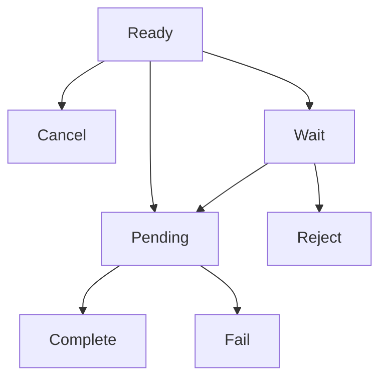

# Invoice API

> **Overview**: API for issuing, querying, and managing invoices for cryptocurrency payments. Provides payment pages including wallet addresses and amount information for customers.

## 💳 Invoice Creation

Create a new payment invoice.

### Request

```http
POST /invoice/create
Authorization: <YOUR_API_KEY>
Content-Type: application/json
```

```json
{
  "customerName": "John Doe",
  "title": "USDT $100 Purchase",
  "amount": "74.074074",
  "stdPrice": "1350.500000",
  "cashAssetId": 1,
  "cashAmount": "100000.000000",
  "cryptoAssetId": 1001,
  "expiredDate": 1800,
  "isNewAddress": false
}
```

> **Request Field Description**

| Field           | Type    | Required | Description                                             |
| --------------- | ------- | -------- | ------------------------------------------------------- |
| `customerName`  | string  | ✅       | Customer name (auto-created if customer doesn't exist)  |
| `title`         | string  | ✅       | Invoice title                                           |
| `amount`        | string  | ✅       | Expected cryptocurrency amount calculated by client     |
| `stdPrice`      | string  | ✅       | Exchange rate at request time                           |
| `cashAssetId`   | number  | ✅       | Fiat currency asset ID (1: KRW, 2: USD)                 |
| `cashAmount`    | string  | ✅       | Fiat currency amount                                    |
| `cryptoAssetId` | number  | ✅       | Cryptocurrency asset ID                                 |
| `expiredDate`   | number  | ✅       | Expiration time (in seconds)                            |
| `isNewAddress`  | boolean | ❌       | Whether to generate new wallet address (default: false) |

### Response

```json
{
  "invoice": {
    "id": "550e8400-e29b-41d4-a716-446655440000",
    "title": "USDT $100 Purchase",
    "idCode": "1/0/0",
    "partnerId": "partner-uuid-123",
    "customerId": "customer-cuid-123",
    "cashAssetId": 1,
    "cryptoAssetId": 1001,
    "walletId": 1,
    "cashAmount": "100000.000000",
    "stdPrice": "1350.500000",
    "cryptoAmount": "74.074074",
    "expiredAt": "2025-09-05T11:00:00.000Z",
    "createdAt": "2025-09-05T10:30:00.000Z",
    "crypto": {
      "id": 1001,
      "name": "USDT-TRX",
      "symbol": "USDT",
      "network": "TRX"
    },
    "cash": {
      "id": 1,
      "name": "Korea Won",
      "symbol": "KRW",
      "network": "LEGAL"
    }
  },
  "url": "https://pay.tapayz.io/550e8400-e29b-41d4-a716-446655440000"
}
```

> **Success Response**
>
> - `invoice`: Created invoice information
> - `url`: Payment page URL where customers can proceed with payment

---

## 📋 Invoice List Query

Query the partner's invoice list.

### Request

```http
GET /invoice?page=1&size=10&startAt=2025-09-01T00:00:00.000Z&endAt=2025-09-05T23:59:59.999Z&customerName=John
Authorization: <YOUR_API_KEY>
```

> **Query Parameters**

| Parameter      | Type   | Required | Description              |
| -------------- | ------ | -------- | ------------------------ |
| `page`         | number | ❌       | Page number (default: 1) |
| `size`         | number | ❌       | Page size (default: 10)  |
| `startAt`      | string | ❌       | Start date (ISO 8601)    |
| `endAt`        | string | ❌       | End date (ISO 8601)      |
| `customerName` | string | ❌       | Filter by customer name  |

### Response

```json
{
  "total": 25,
  "totalPages": 3,
  "list": [
    {
      "id": "550e8400-e29b-41d4-a716-446655440000",
      "title": "USDT $100 Purchase",
      "state": "Complete",
      "cashAmount": "100000.000000",
      "cryptoAmount": "74.074074",
      "stdPrice": "1350.500000",
      "expiredAt": "2025-09-05T11:00:00.000Z",
      "completedAt": "2025-09-05T10:45:00.000Z",
      "createdAt": "2025-09-05T10:30:00.000Z",
      "customer": {
        "id": "customer-cuid-123",
        "name": "John Doe",
        "icon": "/images/customer.svg"
      },
      "crypto": {
        "id": 1001,
        "name": "USDT-TRX",
        "symbol": "USDT",
        "network": "TRX"
      },
      "cash": {
        "id": 1,
        "name": "Korea Won",
        "symbol": "KRW",
        "network": "LEGAL"
      }
    }
  ]
}
```

---

## 🔍 Invoice Detail Query

Query detailed information of a specific invoice.

### Request

```http
GET /invoice/detail?id=550e8400-e29b-41d4-a716-446655440000
Authorization: <YOUR_API_KEY>
```

> **Query Parameters**

| Parameter | Type   | Required | Description |
| --------- | ------ | -------- | ----------- |
| `id`      | string | ✅       | Invoice ID  |

### Response

```json
{
  "id": "550e8400-e29b-41d4-a716-446655440000",
  "state": "Complete",
  "title": "USDT $100 Purchase",
  "stdPrice": "1350.500000",
  "cashAmount": "100000.000000",
  "cryptoAmount": "74.074074",
  "expiredAt": "2025-09-05T11:00:00.000Z",
  "createdAt": "2025-09-05T10:30:00.000Z",
  "partner": {
    "name": "Partner Company",
    "icon": "/images/partner.svg"
  },
  "customer": {
    "name": "John Doe",
    "icon": "/images/customer.svg"
  },
  "cash": {
    "name": "Korea Won",
    "symbol": "KRW",
    "price": "1.000000"
  },
  "crypto": {
    "name": "USDT-TRX",
    "symbol": "USDT",
    "price": "1350.500000"
  },
  "wallet": {
    "address": "TMxF2kPwiuS4QJo8tixV5vd4qVuo7zdtRC",
    "network": "TRX"
  },
  "detail": [],
  "Transaction": [
    {
      "id": "tx-uuid-456",
      "from": "TEHx4cTUvJcGqidzbruvRc2fL9Tez7oHBr",
      "to": "TMxF2kPwiuS4QJo8tixV5vd4qVuo7zdtRC",
      "amount": "74.074074",
      "state": "Complete",
      "type": "DEPOSIT",
      "detail": "d1f10b55e61d16e3616d8d0ac7c42e0edcc8a5587b251239f0a14f587032cb18",
      "blockNum": 75235898,
      "createdAt": "2025-09-05T10:44:52.516Z"
    }
  ]
}
```

---

## 📊 Invoice Status

### Status Values

| Status     | Description                         |
| ---------- | ----------------------------------- |
| `Ready`    | Waiting for payment                 |
| `Wait`     | Waiting for processing              |
| `Pending`  | Blockchain confirmation in progress |
| `Complete` | Payment completed                   |
| `Fail`     | Payment failed                      |
| `Reject`   | Payment rejected                    |
| `Cancel`   | Payment canceled (expired)          |

### Status Flow



> **Status Description**
>
> - **Ready**: Invoice created and waiting for payment
> - **Pending**: Customer sent payment and blockchain confirmation in progress
> - **Complete**: Payment successfully completed
> - **Cancel**: Automatically canceled due to expiration time

---

## 🔔 Webhook Events

Webhook events are sent to registered callback URLs when invoice status changes.

### Invoice Status Update

```json
{
  "event": "invoice.updated",
  "data": {
    "invoiceId": "550e8400-e29b-41d4-a716-446655440000",
    "customerId": "customer-cuid-123",
    "state": "Complete",
    "amount": "74.074074",
    "completedAt": "2025-09-05T10:45:00.000Z"
  }
}
```

### Transaction Creation

```json
{
  "event": "transaction.created",
  "data": {
    "id": "tx-uuid-456",
    "invoiceId": "550e8400-e29b-41d4-a716-446655440000",
    "customerId": "customer-cuid-123",
    "from": "TEHx4cTUvJcGqidzbruvRc2fL9Tez7oHBr",
    "to": "TMxF2kPwiuS4QJo8tixV5vd4qVuo7zdtRC",
    "amount": "74.074074",
    "state": "Pending",
    "type": "DEPOSIT",
    "detail": "d1f10b55e61d16e3616d8d0ac7c42e0edcc8a5587b251239f0a14f587032cb18"
  }
}
```

---

## ⚠️ Error Responses

### Authentication Failed

```json
{
  "statusCode": 401,
  "message": "Unauthorized",
  "timestamp": "2025-09-05T10:30:00.000Z",
  "path": "/invoice/create"
}
```

### Invalid Request

```json
{
  "statusCode": 400,
  "message": "Invalid Asset",
  "timestamp": "2025-09-05T10:30:00.000Z",
  "path": "/invoice/create"
}
```

### Invoice Not Found

```json
{
  "statusCode": 404,
  "message": "Invalid Invoice",
  "timestamp": "2025-09-05T10:30:00.000Z",
  "path": "/invoice/detail"
}
```

---

## 💻 Usage Examples

### Node.js (axios)

```javascript
import axios from "axios";

const API_KEY = "your-api-key-here";
const BASE_URL = "https://api.crypted-pay.com";

// Create invoice
async function createInvoice() {
  try {
    const response = await axios.post(
      `${BASE_URL}/invoice/create`,
      {
        customerName: "John Doe",
        title: "USDT $100 Purchase",
        amount: "74.074074",
        stdPrice: "1350.500000",
        cashAssetId: 1,
        cashAmount: "100000.000000",
        cryptoAssetId: 1001,
        expiredDate: 1800,
        isNewAddress: false,
      },
      {
        headers: {
          Authorization: API_KEY,
          "Content-Type": "application/json",
        },
      }
    );

    console.log("Invoice created:", response.data.invoice.id);
    console.log("Payment URL:", response.data.url);

    return response.data;
  } catch (error) {
    console.error(
      "Invoice creation failed:",
      error.response?.data || error.message
    );
  }
}

// Get invoice list
async function getInvoiceList(page = 1, size = 10) {
  try {
    const response = await axios.get(`${BASE_URL}/invoice`, {
      headers: {
        Authorization: API_KEY,
      },
      params: {
        page,
        size,
        startAt: "2025-09-01T00:00:00.000Z",
        endAt: "2025-09-05T23:59:59.999Z",
      },
    });

    console.log(`Total ${response.data.total} invoices`);
    console.log("Invoice list:", response.data.list);

    return response.data;
  } catch (error) {
    console.error(
      "Invoice list query failed:",
      error.response?.data || error.message
    );
  }
}

// Get invoice detail
async function getInvoiceDetail(invoiceId) {
  try {
    const response = await axios.get(`${BASE_URL}/invoice/detail`, {
      headers: {
        Authorization: API_KEY,
      },
      params: {
        id: invoiceId,
      },
    });

    console.log("Invoice detail:", response.data);
    console.log("Wallet address:", response.data.wallet.address);

    return response.data;
  } catch (error) {
    console.error(
      "Invoice detail query failed:",
      error.response?.data || error.message
    );
  }
}
```

---

## ⚡ Important Notes

> **Critical Information**
>
> 1. **Authentication Required**: Valid API key must be included in the `Authorization` header for all API calls.
> 2. **Expiration Time**: Invoices are automatically canceled after the set expiration time.
> 3. **Exchange Rate Fluctuation**: Amount may be adjusted due to differences between `stdPrice` and actual processing time rate.

> **Tips**
>
> - If customer doesn't exist, it's automatically created with `customerName`.
> - Setting `isNewAddress: true` generates a new wallet address each time.
> - Payment status can be checked in real-time through Webhooks.

---

## 🔗 Related Documentation

- [Price API](./price) - Price query API
- [Customer API](./customer) - Customer management API
- [Transaction API](./transaction) - Transaction query API
- [Invoice Webhook](../webhook/invoice) - Invoice Webhook
