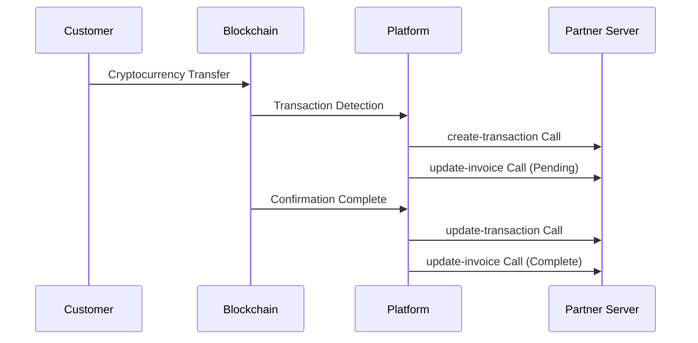

# Webhook

> **Overview**: Tapayz's Webhook system is an HTTP callback mechanism that provides real-time notifications of various events occurring during the payment process. Whenever events such as invoice status changes, transaction creation/updates occur, notifications are sent to registered endpoints.

## 🔔 Webhook Types

### Supported Events

| Event                    | Callback URL                   | Description                                                                |
| ------------------------ | ------------------------------ | -------------------------------------------------------------------------- |
| **Invoice Update**       | `/callback/update-invoice`     | Called when invoice status changes                                         |
| **Transaction Creation** | `/callback/create-transaction` | Called when transaction is first recorded on blockchain                    |
| **Transaction Update**   | `/callback/update-transaction` | Called when transaction confirmation is completed and final status changes |

### Event Flow



---

## 📨 Common Payload Structure

All Webhook events follow this basic structure:

```json
{
  "event": "event_type",
  "timestamp": "2025-09-05T10:45:00.000Z",
  "data": {
    // Event-specific data
  }
}
```

### Common Fields

| Field       | Type   | Description                      |
| ----------- | ------ | -------------------------------- |
| `event`     | string | Event type                       |
| `timestamp` | string | Event occurrence time (ISO 8601) |
| `data`      | object | Event-specific detailed data     |

---

## 🔒 Security and Authentication

### 1. Signature Verification

> **Required Security Measure**: It is strongly recommended to implement HMAC-SHA256 signature verification to confirm the authenticity of Webhook requests.

**Signature Generation Method:**

```javascript
const crypto = require("crypto");

const signature = crypto
  .createHmac("sha256", WEBHOOK_SECRET)
  .update(JSON.stringify(payload))
  .digest("hex");
```

**Verification Implementation:**

```javascript
function verifySignature(payload, signature, secret) {
  const hash = crypto
    .createHmac("sha256", secret)
    .update(JSON.stringify(payload))
    .digest("hex");

  return crypto.timingSafeEqual(
    Buffer.from(signature, "hex"),
    Buffer.from(hash, "hex")
  );
}

// Usage example
app.post("/callback/*", (req, res) => {
  const signature = req.headers["x-signature"];
  const isValid = verifySignature(
    req.body,
    signature,
    process.env.WEBHOOK_SECRET
  );

  if (!isValid) {
    return res.status(401).json({ error: "Invalid signature" });
  }

  // Webhook processing logic
});
```

### 2. IP Whitelist

Restrict Webhook reception to specific IP addresses only:

```javascript
const allowedIPs = ["52.78.123.45", "13.125.67.89"]; // Platform server IPs

app.use("/callback", (req, res, next) => {
  const clientIP = req.ip || req.connection.remoteAddress;

  if (!allowedIPs.includes(clientIP)) {
    return res.status(403).json({ error: "Forbidden IP" });
  }

  next();
});
```

---

## ⚡ Best Practices

### 1. Ensure Idempotency

Since the same event may be sent multiple times, ensure idempotency:

```javascript
const processedEvents = new Set();

app.post("/callback/*", (req, res) => {
  // Generate unique event identifier
  const eventId = generateEventId(req.body);

  if (processedEvents.has(eventId)) {
    return res.status(200).json({ status: "already_processed" });
  }

  try {
    processEvent(req.body);
    processedEvents.add(eventId);
    res.status(200).json({ status: "ok" });
  } catch (error) {
    res.status(500).json({ error: "Processing failed" });
  }
});
```

### 2. Asynchronous Processing

Separate heavy operations to background to ensure fast response:

```javascript
const Queue = require("bull"); // or other queue system
const webhookQueue = new Queue("webhook processing");

app.post("/callback/*", (req, res) => {
  // Fast response
  res.status(200).json({ status: "received" });

  // Background processing
  webhookQueue.add("process-webhook", req.body);
});

// Actual processing in worker
webhookQueue.process("process-webhook", async (job) => {
  const payload = job.data;
  await processWebhookEvent(payload);
});
```

---

## ⚠️ Important Notes

> **Critical Points**
>
> 1. **Response Time**: Webhook handlers must respond within **5 seconds**.
> 2. **Status Code**: Must return **200** status code on success.
> 3. **Retry**: **Up to 3 retries** on failure.
> 4. **Order**: Event order is not guaranteed.
> 5. **Duplicates**: Same event may be sent multiple times.

> **Tips**
>
> - Always separate heavy processing into background jobs.
> - Use database transactions to ensure consistency.
> - Test thoroughly in test environment before applying to production.
> - Prepare alternative query methods for Webhook failures.

---

## 🔗 Related Documentation

- [Invoice Webhook](./invoice) - Invoice Webhook Details
- [Transaction Webhook](./transaction) - Transaction Webhook Details
- [Invoice API](/api/invoice) - Invoice API
- [Transaction API](/api/transaction) - Transaction Query API
