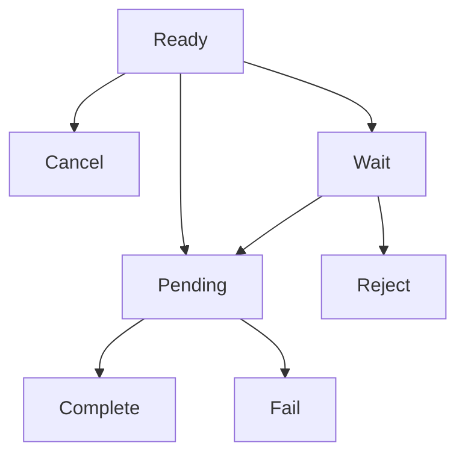

# インボイス API (Invoice API)

> [!info] 概要 暗号通貨決済のためのインボイス（決済請求書）を発行、照会、管理するAPIです。顧客が決済できるウォレットアドレスと金額情報を含む決済ページを提供します。

## 💳 インボイス作成

新しい決済インボイスを作成します。

### リクエスト

```http
POST /invoice/create
Authorization: <YOUR_API_KEY>
Content-Type: application/json
```

```json
{
  "customerName": "田中太郎",
  "title": "USDT 10万円購入",
  "amount": "74.074074",
  "stdPrice": "1350.500000",
  "cashAssetId": 1,
  "cashAmount": "100000.000000",
  "cryptoAssetId": 1001,
  "expiredDate": 1800,
  "isNewAddress": false
}
```

> [!note] リクエストフィールド説明

| フィールド      | 型      | 必須 | 説明                                     |
| --------------- | ------- | ---- | ---------------------------------------- |
| `customerName`  | string  | ✅   | 顧客名 (顧客が存在しない場合は自動作成)  |
| `title`         | string  | ✅   | インボイスタイトル                       |
| `amount`        | string  | ✅   | クライアントが計算した予想暗号通貨数量   |
| `stdPrice`      | string  | ✅   | リクエスト時点の為替レート               |
| `cashAssetId`   | number  | ✅   | 法定通貨資産ID (1: KRW, 2: USD)          |
| `cashAmount`    | string  | ✅   | 法定通貨金額                             |
| `cryptoAssetId` | number  | ✅   | 暗号通貨資産ID                           |
| `expiredDate`   | number  | ✅   | 期限時間 (秒単位)                        |
| `isNewAddress`  | boolean | ❌   | 新しいウォレットアドレス生成有無 (デフォルト: false) |

### レスポンス

```json
{
  "invoice": {
    "id": "550e8400-e29b-41d4-a716-446655440000",
    "title": "USDT 10万円購入",
    "idCode": "1/0/0",
    "partnerId": "partner-uuid-123",
    "customerId": "customer-cuid-123",
    "cashAssetId": 1,
    "cryptoAssetId": 1001,
    "walletId": 1,
    "cashAmount": "100000.000000",
    "stdPrice": "1350.500000",
    "cryptoAmount": "74.074074",
    "expiredAt": "2025-09-05T11:00:00.000Z",
    "createdAt": "2025-09-05T10:30:00.000Z",
    "crypto": {
      "id": 1001,
      "name": "USDT-TRX",
      "symbol": "USDT",
      "network": "TRX"
    },
    "cash": {
      "id": 1,
      "name": "Korea Won",
      "symbol": "KRW",
      "network": "LEGAL"
    }
  },
  "url": "https://pay.tapayz.io/550e8400-e29b-41d4-a716-446655440000"
}
```

> [!tip] 成功レスポンス
>
> - `invoice`: 作成されたインボイス情報
> - `url`: 顧客が決済を進行できる決済ページURL

---

## 📋 インボイスリスト照会

パートナーのインボイスリストを照会します。

### リクエスト

```http
GET /invoice?page=1&size=10&startAt=2025-09-01T00:00:00.000Z&endAt=2025-09-05T23:59:59.999Z&customerName=田中太郎
Authorization: <YOUR_API_KEY>
```

> [!note] クエリパラメータ

| パラメータ     | 型     | 必須 | 説明                       |
| -------------- | ------ | ---- | -------------------------- |
| `page`         | number | ❌   | ページ番号 (デフォルト: 1)  |
| `size`         | number | ❌   | ページサイズ (デフォルト: 10) |
| `startAt`      | string | ❌   | 開始日時 (ISO 8601)         |
| `endAt`        | string | ❌   | 終了日時 (ISO 8601)         |
| `customerName` | string | ❌   | 顧客名でフィルタリング      |

### レスポンス

```json
{
  "total": 25,
  "totalPages": 3,
  "list": [
    {
      "id": "550e8400-e29b-41d4-a716-446655440000",
      "title": "USDT 10万円購入",
      "state": "Complete",
      "cashAmount": "100000.000000",
      "cryptoAmount": "74.074074",
      "stdPrice": "1350.500000",
      "expiredAt": "2025-09-05T11:00:00.000Z",
      "completedAt": "2025-09-05T10:45:00.000Z",
      "createdAt": "2025-09-05T10:30:00.000Z",
      "customer": {
        "id": "customer-cuid-123",
        "name": "田中太郎",
        "icon": "/images/customer.svg"
      },
      "crypto": {
        "id": 1001,
        "name": "USDT-TRX",
        "symbol": "USDT",
        "network": "TRX"
      },
      "cash": {
        "id": 1,
        "name": "Korea Won",
        "symbol": "KRW",
        "network": "LEGAL"
      }
    }
  ]
}
```

---

## 🔍 インボイス詳細照会

特定インボイスの詳細情報を照会します。

### リクエスト

```http
GET /invoice/detail?id=550e8400-e29b-41d4-a716-446655440000
Authorization: <YOUR_API_KEY>
```

> [!note] クエリパラメータ

| パラメータ | 型     | 必須 | 説明         |
| ---------- | ------ | ---- | ------------ |
| `id`       | string | ✅   | インボイスID |

### レスポンス

```json
{
  "id": "550e8400-e29b-41d4-a716-446655440000",
  "state": "Complete",
  "title": "USDT 10万円購入",
  "stdPrice": "1350.500000",
  "cashAmount": "100000.000000",
  "cryptoAmount": "74.074074",
  "expiredAt": "2025-09-05T11:00:00.000Z",
  "createdAt": "2025-09-05T10:30:00.000Z",
  "partner": {
    "name": "パートナー会社",
    "icon": "/images/partner.svg"
  },
  "customer": {
    "name": "田中太郎",
    "icon": "/images/customer.svg"
  },
  "cash": {
    "name": "Korea Won",
    "symbol": "KRW",
    "price": "1.000000"
  },
  "crypto": {
    "name": "USDT-TRX",
    "symbol": "USDT",
    "price": "1350.500000"
  },
  "wallet": {
    "address": "TMxF2kPwiuS4QJo8tixV5vd4qVuo7zdtRC",
    "network": "TRX"
  },
  "detail": [],
  "Transaction": [
    {
      "id": "tx-uuid-456",
      "from": "TEHx4cTUvJcGqidzbruvRc2fL9Tez7oHBr",
      "to": "TMxF2kPwiuS4QJo8tixV5vd4qVuo7zdtRC",
      "amount": "74.074074",
      "state": "Complete",
      "type": "DEPOSIT",
      "detail": "d1f10b55e61d16e3616d8d0ac7c42e0edcc8a5587b251239f0a14f587032cb18",
      "blockNum": 75235898,
      "createdAt": "2025-09-05T10:44:52.516Z"
    }
  ]
}
```

---

## 📊 インボイス状態

### 状態値

| 状態       | 説明             |
| ---------- | ---------------- |
| `Ready`    | 決済待機中       |
| `Wait`     | 処理待機中       |
| `Pending`  | ブロックチェーン確認中 |
| `Complete` | 決済完了         |
| `Fail`     | 決済失敗         |
| `Reject`   | 決済拒否         |
| `Cancel`   | 決済キャンセル (期限切れ) |

### 状態フロー



> [!info] 状態説明
>
> - **Ready**: インボイスが作成され決済待機中
> - **Pending**: 顧客が送金してブロックチェーンで確認中
> - **Complete**: 決済が正常に完了
> - **Cancel**: 期限時間が過ぎて自動キャンセル

---

## 🔔 Webhook イベント

インボイス状態変更時に登録されたコールバックURLへイベントが送信されます。

### インボイス状態アップデート

```json
{
  "event": "invoice.updated",
  "data": {
    "invoiceId": "550e8400-e29b-41d4-a716-446655440000",
    "customerId": "customer-cuid-123",
    "state": "Complete",
    "amount": "74.074074",
    "completedAt": "2025-09-05T10:45:00.000Z"
  }
}
```

### トランザクション作成

```json
{
  "event": "transaction.created",
  "data": {
    "id": "tx-uuid-456",
    "invoiceId": "550e8400-e29b-41d4-a716-446655440000",
    "customerId": "customer-cuid-123",
    "from": "TEHx4cTUvJcGqidzbruvRc2fL9Tez7oHBr",
    "to": "TMxF2kPwiuS4QJo8tixV5vd4qVuo7zdtRC",
    "amount": "74.074074",
    "state": "Pending",
    "type": "DEPOSIT",
    "detail": "d1f10b55e61d16e3616d8d0ac7c42e0edcc8a5587b251239f0a14f587032cb18"
  }
}
```

---

## ⚠️ エラーレスポンス

### 認証失敗

```json
{
  "statusCode": 401,
  "message": "Unauthorized",
  "timestamp": "2025-09-05T10:30:00.000Z",
  "path": "/invoice/create"
}
```

### 不正なリクエスト

```json
{
  "statusCode": 400,
  "message": "Invalid Asset",
  "timestamp": "2025-09-05T10:30:00.000Z",
  "path": "/invoice/create"
}
```

### インボイス無し

```json
{
  "statusCode": 404,
  "message": "Invalid Invoice",
  "timestamp": "2025-09-05T10:30:00.000Z",
  "path": "/invoice/detail"
}
```

---

## 💻 使用例

### Node.js (axios)

```javascript
import axios from "axios";

const API_KEY = "your-api-key-here";
const BASE_URL = "https://api.crypted-pay.com";

// インボイス作成
async function createInvoice() {
  try {
    const response = await axios.post(
      `${BASE_URL}/invoice/create`,
      {
        customerName: "田中太郎",
        title: "USDT 10万円購入",
        amount: "74.074074",
        stdPrice: "1350.500000",
        cashAssetId: 1,
        cashAmount: "100000.000000",
        cryptoAssetId: 1001,
        expiredDate: 1800,
        isNewAddress: false,
      },
      {
        headers: {
          Authorization: API_KEY,
          "Content-Type": "application/json",
        },
      }
    );

    console.log("インボイス作成完了:", response.data.invoice.id);
    console.log("決済URL:", response.data.url);

    return response.data;
  } catch (error) {
    console.error("インボイス作成失敗:", error.response?.data || error.message);
  }
}

// インボイスリスト照会
async function getInvoiceList(page = 1, size = 10) {
  try {
    const response = await axios.get(`${BASE_URL}/invoice`, {
      headers: {
        Authorization: API_KEY,
      },
      params: {
        page,
        size,
        startAt: "2025-09-01T00:00:00.000Z",
        endAt: "2025-09-05T23:59:59.999Z",
      },
    });

    console.log(`合計${response.data.total}個のインボイス`);
    console.log("インボイスリスト:", response.data.list);

    return response.data;
  } catch (error) {
    console.error(
      "インボイスリスト照会失敗:",
      error.response?.data || error.message
    );
  }
}

// インボイス詳細照会
async function getInvoiceDetail(invoiceId) {
  try {
    const response = await axios.get(`${BASE_URL}/invoice/detail`, {
      headers: {
        Authorization: API_KEY,
      },
      params: {
        id: invoiceId,
      },
    });

    console.log("インボイス詳細:", response.data);
    console.log("ウォレットアドレス:", response.data.wallet.address);

    return response.data;
  } catch (error) {
    console.error(
      "インボイス詳細照会失敗:",
      error.response?.data || error.message
    );
  }
}
```

### Python (requests)

```python
import requests
from datetime import datetime, timedelta

API_KEY = 'your-api-key-here'
BASE_URL = 'https://api.crypted-pay.com'

headers = {
    'Authorization': API_KEY,
    'Content-Type': 'application/json'
}

# インボイス作成
def create_invoice():
    payload = {
        'customerName': '田中太郎',
        'title': 'USDT 10万円購入',
        'amount': '74.074074',
        'stdPrice': '1350.500000',
        'cashAssetId': 1,
        'cashAmount': '100000.000000',
        'cryptoAssetId': 1001,
        'expiredDate': 1800,
        'isNewAddress': False
    }

    try:
        response = requests.post(f'{BASE_URL}/invoice/create',
                               json=payload, headers=headers)
        response.raise_for_status()

        data = response.json()
        print(f"インボイス作成完了: {data['invoice']['id']}")
        print(f"決済URL: {data['url']}")

        return data
    except requests.exceptions.RequestException as e:
        print(f"インボイス作成失敗: {e}")

# インボイスリスト照会
def get_invoice_list(page=1, size=10):
    params = {
        'page': page,
        'size': size,
        'startAt': '2025-09-01T00:00:00.000Z',
        'endAt': '2025-09-05T23:59:59.999Z'
    }

    try:
        response = requests.get(f'{BASE_URL}/invoice',
                              headers={'Authorization': API_KEY},
                              params=params)
        response.raise_for_status()

        data = response.json()
        print(f"合計{data['total']}個のインボイス")

        return data
    except requests.exceptions.RequestException as e:
        print(f"インボイスリスト照会失敗: {e}")
```

---

## ⚡ 注意事項

> [!warning] 重要事項
>
> 1. **認証必須**: すべてのAPI呼び出し時に`Authorization`ヘッダーに有効なAPIキーが必要です。
> 2. **期限時間**: インボイスは設定した期限時間後に自動的に`Cancel`状態になります。
> 3. **為替変動**: `stdPrice`と実際処理時点の為替レート差により金額が調整される場合があります。

> [!tip] ヒント
>
> - 顧客が存在しない場合は`customerName`で自動作成されます。
> - `isNewAddress: true`に設定すると毎回新しいウォレットアドレスを生成します。
> - Webhookを通じてリアルタイムで決済状態を確認できます。

---

## 🔗 関連ドキュメント

- [価格照会 API](./price) - 価格照会 API
- [顧客管理 API](./customer) - 顧客管理 API
- [取引照会 API](./transaction) - 取引照会 API
- [インボイス Webhook](../webhook/invoice) - インボイス Webhook

#api #invoice #payment #cryptocurrency #documentation