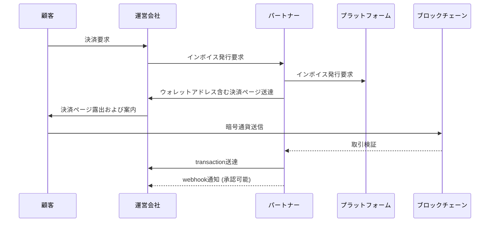

# はじめに

Tapayzは誰でも簡単に暗号通貨を利用して決済を受けることができるよう設計された決済プラットフォームです。
このガイドでは、Tapayz連携のための **全体決済フロー**、**API Key発行および使用方法**、**Webhook設定** などを紹介します。

---

## 決済フロー詳細

以下はTapayzの基本決済処理フローです。



1. 顧客が運営会社サイトで決済を要求します。
2. 運営会社サーバーは **パートナーサーバー** にインボイス発行を要求します。
3. パートナーサーバーは **プラットフォームサーバー** にインボイス発行を要求します。
4. プラットフォームサーバーは **ウォレットアドレスが含まれた決済ページ** を運営会社サーバーに送達します。
5. 運営会社サーバーは顧客に決済ページを露出し決済案内を提供します。
6. 顧客は指定されたウォレットアドレスに暗号通貨を送信します。
7. ネットワークブロックに取引が記録されるとtransactionを生成して運営会社に送達します。
8. ネットワークコンファームが完了すると取引が最終確定され、webhookで決済完了状態を送達します。

---

## 事前準備

1. **パートナーアカウント作成**
   Tapayzコンソールで下部パートナーアカウントを作成後、パートナーに送達します。

2. **API KEY発行**

   - パートナーアカウントが作成されるとAPI KEYが自動発行されます。
   - 発行されたキーは **コンソール → マイページ → API情報** で確認できます。
   - API呼び出し時、`Authorization`ヘッダーに該当キーを設定して使用します。

   **例（curl）:**

   ```bash
   curl -X GET "https://api.crypted-pay.com/invoices"
   -H "Authorization: <YOUR_API_KEY>"
   ```

   **例（Node.js axios）:**

   ```javascript
   import axios from "axios";

   const response = await axios.get("https://api.crypted-pay.com/invoices", {
     headers: { Authorization: "<YOUR_API_KEY>" },
   });

   console.log(response.data);
   ```

---

## Webhook設定

発行されたインボイスと取引進行情報を受けるためには **コールバックURL登録** が必要です。

### コールバックイベント種類

| イベント            | コールバックURL例              | 説明                                 |
| ------------------- | ------------------------------ | ------------------------------------ |
| インボイス更新      | `/callback/update-invoice`     | インボイス状態変更時呼び出し         |
| トランザクション生成 | `/callback/create-transaction` | ブロックチェーンに最初の取引が記録されると呼び出し |
| トランザクション更新 | `/callback/update-transaction` | コンファーム完了および最終状態更新   |

### Webhook JSON例

**`/callback/update-invoice`**

```json
{
  "state": "Pending",
  "customerId": 7,
  "invoiceId": "156c43e3-02f5-47f3-b28c-...",
  "amount": "1.228607"
}
```

**`/callback/create-transaction`**

```json
{
  "id": "1",
  "partnerId": "834115c0-81d4-4882-ba8b-f360d86a2c47",
  "customerId": 7,
  "invoiceId": "156c43e3-02f5-47f3-b28c-6bf6c511d796",
  "idCode": "1/0",
  "assetId": 1001,
  "from": "TEHx4cTUvJcGqidzbruvRc2fL9Tez7oHBr",
  "to": "TMxF2kPwiuS4QJo8tixV5vd4qVuo7zdtRC",
  "amount": "1.229",
  "fee": "0",
  "balance": null,
  "state": "Pending",
  "type": "DEPOSIT",
  "detail": "d1f10b55e61d16e3616d8d0ac7c42e0edcc8a5587b251239f0a14f587032cb18",
  "blockNum": 75235898,
  "memo": null,
  "createdAt": "2025-08-28T07:44:52.516Z",
  "updatedAt": "2025-08-28T07:44:52.516Z"
}
```

**`/callback/update-transaction`**

```json
{
  "id": "tx_4f5d9a",
  "state": "Complete",
  "detail": "d1f10b55e61d16e3...",
  "amount": "1.228607"
}
```

---

## 次のステップ

- [Quick Flow](./quickflow.md) に従ってください