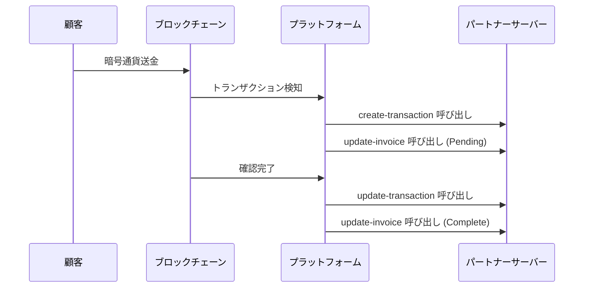

# Webhook

> [!info] 概要 TapayzのWebhookシステムは、決済プロセス中に発生する様々なイベントをリアルタイムで通知するHTTPコールバックメカニズムです。インボイス状態変更、トランザクション作成・更新などのイベントが発生するたびに、登録されたエンドポイントに通知を送信します。

## 🔔 Webhook種類

### サポートするイベント

| イベント              | コールバックURL                | 説明                                         |
| --------------------- | ------------------------------ | -------------------------------------------- |
| **インボイス更新**    | `/callback/update-invoice`     | インボイス状態変更時に呼び出し               |
| **トランザクション作成** | `/callback/create-transaction` | ブロックチェーンにトランザクションが最初に記録される時に呼び出し |
| **トランザクション更新** | `/callback/update-transaction` | トランザクション確認完了及び最終状態変更時に呼び出し |

### イベントフロー



---

## 📨 共通ペイロード構造

すべてのWebhookイベントは以下のような基本構造に従います：

```json
{
  "event": "イベントタイプ",
  "timestamp": "2025-09-05T10:45:00.000Z",
  "data": {
    // イベント別特化データ
  }
}
```

### 共通フィールド

| フィールド  | 型     | 説明                        |
| ----------- | ------ | --------------------------- |
| `event`     | string | イベントタイプ              |
| `timestamp` | string | イベント発生時間 (ISO 8601) |
| `data`      | object | イベント別詳細データ        |

---

## 🔒 セキュリティと認証

### 1. シグネチャー検証

> [!warning] 必須セキュリティ措置 Webhookリクエストの真正性を確認するため、HMAC-SHA256シグネチャー検証を実装することを強く推奨します。

**シグネチャー生成方法：**

```javascript
const crypto = require("crypto");

const signature = crypto
  .createHmac("sha256", WEBHOOK_SECRET)
  .update(JSON.stringify(payload))
  .digest("hex");
```

**検証実装：**

```javascript
function verifySignature(payload, signature, secret) {
  const hash = crypto
    .createHmac("sha256", secret)
    .update(JSON.stringify(payload))
    .digest("hex");

  return crypto.timingSafeEqual(
    Buffer.from(signature, "hex"),
    Buffer.from(hash, "hex")
  );
}

// 使用例
app.post("/callback/*", (req, res) => {
  const signature = req.headers["x-signature"];
  const isValid = verifySignature(
    req.body,
    signature,
    process.env.WEBHOOK_SECRET
  );

  if (!isValid) {
    return res.status(401).json({ error: "Invalid signature" });
  }

  // Webhook処理ロジック
});
```

### 2. IPホワイトリスト

特定のIPアドレスからのみWebhookを受信するよう制限：

```javascript
const allowedIPs = ["52.78.123.45", "13.125.67.89"]; // プラットフォームサーバーIP

app.use("/callback", (req, res, next) => {
  const clientIP = req.ip || req.connection.remoteAddress;

  if (!allowedIPs.includes(clientIP)) {
    return res.status(403).json({ error: "Forbidden IP" });
  }

  next();
});
```

---

## ⚡ ベストプラクティス

### 1. 冪等性保証

同一イベントが複数回送信される可能性があるため、冪等性を保証してください：

```javascript
const processedEvents = new Set();

app.post("/callback/*", (req, res) => {
  // イベント固有識別子生成
  const eventId = generateEventId(req.body);

  if (processedEvents.has(eventId)) {
    return res.status(200).json({ status: "already_processed" });
  }

  try {
    processEvent(req.body);
    processedEvents.add(eventId);
    res.status(200).json({ status: "ok" });
  } catch (error) {
    res.status(500).json({ error: "Processing failed" });
  }
});

function generateEventId(payload) {
  // イベントタイプと主要識別子で固有ID生成
  switch (payload.event) {
    case "invoice.updated":
      return `${payload.data.invoiceId}-${payload.data.state}-${payload.timestamp}`;
    case "transaction.created":
    case "transaction.updated":
      return `${payload.data.id}-${payload.data.state}-${payload.timestamp}`;
    default:
      return `${payload.event}-${payload.timestamp}`;
  }
}
```

### 2. 非同期処理

重い作業はバックグラウンドに分離して、迅速なレスポンスを保証：

```javascript
const Queue = require("bull"); // または他のキューシステム
const webhookQueue = new Queue("webhook processing");

app.post("/callback/*", (req, res) => {
  // 迅速なレスポンス
  res.status(200).json({ status: "received" });

  // バックグラウンド処理
  webhookQueue.add("process-webhook", req.body);
});

// ワーカーで実際の処理
webhookQueue.process("process-webhook", async (job) => {
  const payload = job.data;
  await processWebhookEvent(payload);
});
```

### 3. リトライメカニズム

```javascript
async function processEventWithRetry(eventData, maxRetries = 3) {
  for (let attempt = 1; attempt <= maxRetries; attempt++) {
    try {
      await processEvent(eventData);
      return { success: true };
    } catch (error) {
      console.error(`リトライ ${attempt}/${maxRetries} 失敗:`, error);

      if (attempt === maxRetries) {
        // 最終失敗 - デッドレターキューに保存
        await saveToDeadLetterQueue(eventData, error);
        throw error;
      }

      // 指数バックオフ (1秒, 2秒, 4秒...)
      await new Promise((resolve) =>
        setTimeout(resolve, Math.pow(2, attempt) * 1000)
      );
    }
  }
}
```

### 4. ログとモニタリング

```javascript
const winston = require("winston");

const logger = winston.createLogger({
  level: "info",
  format: winston.format.combine(
    winston.format.timestamp(),
    winston.format.json()
  ),
  transports: [new winston.transports.File({ filename: "webhook.log" })],
});

app.post("/callback/*", (req, res) => {
  const startTime = Date.now();
  const payload = req.body;

  logger.info("Webhook受信", {
    event: payload.event,
    path: req.path,
    userAgent: req.headers["user-agent"],
    ip: req.ip,
  });

  try {
    processEvent(payload);

    const duration = Date.now() - startTime;
    logger.info("Webhook処理完了", {
      event: payload.event,
      duration: `${duration}ms`,
      status: "success",
    });

    res.status(200).json({ status: "ok" });
  } catch (error) {
    logger.error("Webhook処理失敗", {
      event: payload.event,
      error: error.message,
      stack: error.stack,
    });

    res.status(500).json({ error: "Processing failed" });
  }
});
```

---

## 🔧 テストとデバッグ

### ローカル開発環境設定

**1. ngrokを使用したローカルトンネリング：**

```bash
# ngrok インストール後
ngrok http 3000

# 出力されたURLをWebhook URLとして登録
# 例: https://abc123.ngrok.io/callback/update-invoice
```

**2. テストサーバー構成：**

```javascript
const express = require("express");
const app = express();

app.use(express.json());

// すべてのWebhookイベントのログ
app.post("/callback/*", (req, res) => {
  console.log("=== Webhook受信 ===");
  console.log("Path:", req.path);
  console.log("Headers:", req.headers);
  console.log("Body:", JSON.stringify(req.body, null, 2));
  console.log("==================");

  res.status(200).json({ status: "ok" });
});

app.listen(3000, () => {
  console.log("テストサーバーがポート3000で実行中");
});
```

### 手動テスト

Webhook動作を確認するための手動テスト：

```bash
# インボイス更新テスト
curl -X POST http://localhost:3000/callback/update-invoice \
  -H "Content-Type: application/json" \
  -H "X-Signature: test-signature" \
  -d '{
    "event": "invoice.updated",
    "timestamp": "2025-09-05T10:45:00.000Z",
    "data": {
      "invoiceId": "test-invoice-123",
      "state": "Complete"
    }
  }'

# トランザクション作成テスト
curl -X POST http://localhost:3000/callback/create-transaction \
  -H "Content-Type: application/json" \
  -d '{
    "event": "transaction.created",
    "timestamp": "2025-09-05T10:44:52.516Z",
    "data": {
      "id": "test-tx-456",
      "state": "Pending"
    }
  }'
```

---

## 📊 モニタリングとアラート

### パフォーマンスメトリクス

モニタリングすべき主要指標：

```javascript
const metrics = {
  webhookReceived: 0,
  webhookProcessed: 0,
  webhookFailed: 0,
  averageProcessingTime: 0,
};

// メトリクス収集
app.post("/callback/*", (req, res) => {
  const startTime = Date.now();
  metrics.webhookReceived++;

  try {
    processEvent(req.body);
    metrics.webhookProcessed++;

    const duration = Date.now() - startTime;
    metrics.averageProcessingTime =
      (metrics.averageProcessingTime + duration) / 2;

    res.status(200).json({ status: "ok" });
  } catch (error) {
    metrics.webhookFailed++;
    res.status(500).json({ error: "Processing failed" });
  }
});

// メトリクスエンドポイント
app.get("/metrics", (req, res) => {
  res.json(metrics);
});
```

### ヘルスチェック

```javascript
app.get("/health", (req, res) => {
  const health = {
    status: "healthy",
    timestamp: new Date().toISOString(),
    uptime: process.uptime(),
    memory: process.memoryUsage(),
    webhookStatus: {
      received: metrics.webhookReceived,
      processed: metrics.webhookProcessed,
      failed: metrics.webhookFailed,
      successRate:
        metrics.webhookReceived > 0
          ? (
              (metrics.webhookProcessed / metrics.webhookReceived) *
              100
            ).toFixed(2)
          : 0,
    },
  };

  res.json(health);
});
```

---

## ⚠️ 注意事項

> [!warning] 重要事項
>
> 1. **レスポンス時間**: Webhookハンドラーは**5秒以内**にレスポンスする必要があります。
> 2. **ステータスコード**: 成功時は必ず**200**ステータスコードを返してください。
> 3. **リトライ**: 失敗時**最大3回**までリトライされます。
> 4. **順序**: イベント順序が保証されない場合があります。
> 5. **重複**: 同一イベントが複数回送信される場合があります。

> [!tip] ヒント
>
> - 重い処理は必ずバックグラウンド作業に分離してください。
> - データベーストランザクションを使用して一貫性を保証してください。
> - テスト環境で十分に検証してからプロダクションに適用してください。
> - Webhook失敗時の代替照会方法を準備してください。

---

## 🔗 関連ドキュメント

- [インボイス Webhook](./invoice) - インボイス Webhook 詳細
- [トランザクション Webhook](./transaction) - トランザクション Webhook 詳細
- [インボイス API](../api/invoice) - インボイス API
- [取引照会 API](../api/transaction) - 取引照会 API

#webhook #callback #security #monitoring #documentation