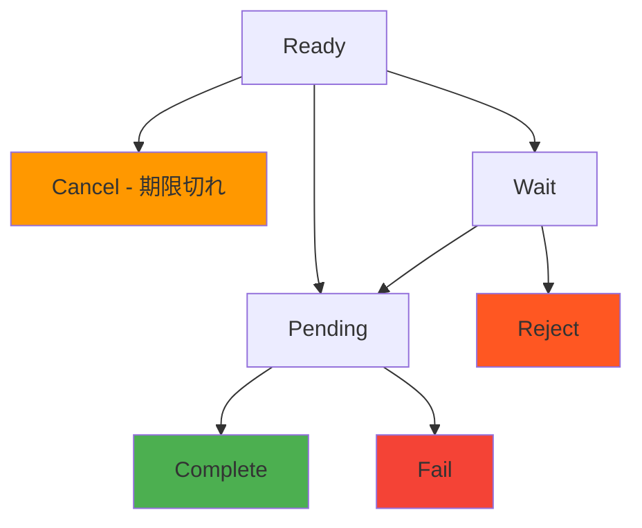

# インボイス Webhook

> [!info] 概要 インボイス状態が変更されるたびに`/callback/update-invoice`エンドポイントにリアルタイム通知を送信します。決済完了、期限切れ、失敗などの状態変更を即座に検知してビジネスロジックを処理できます。

> [!note] 全体 Webhook ガイド セキュリティ、リトライ、テスト方法など全般的なWebhook実装ガイドは[Webhook ガイド](./README)を参考してください。

## 🔔 インボイスイベント

### イベントタイプ: `invoice.updated`

**発生時点：**

- 顧客が決済を完了した時 (`Ready` → `Pending` → `Complete`)
- インボイスが期限切れになった時 (`Ready` → `Cancel`)
- 決済が失敗した時 (`Pending` → `Fail`)
- 決済が拒否された時 (`Wait` → `Reject`)

### 状態変更フロー



> [!note] 状態別Webhook送信
>
> - **Ready → Pending**: 顧客が送金を開始する時
> - **Pending → Complete**: ブロックチェーン確認完了時
> - **Pending → Fail**: 金額不一致またはトランザクション失敗時
> - **Ready → Cancel**: 期限時間到達時 (スケジューラーが1分毎に確認)

---

## 📨 Webhook ペイロード

### 決済完了 (Complete)

```json
{
  "event": "invoice.updated",
  "timestamp": "2025-09-05T10:45:00.000Z",
  "data": {
    "invoiceId": "550e8400-e29b-41d4-a716-446655440000",
    "customerId": "customer-cuid-123",
    "customerName": "田中太郎",
    "state": "Complete",
    "previousState": "Pending",
    "title": "USDT 10万円購入",
    "cashAmount": "100000.000000",
    "cryptoAmount": "74.074074",
    "cashAssetId": 1,
    "cryptoAssetId": 1001,
    "completedAt": "2025-09-05T10:45:00.000Z",
    "createdAt": "2025-09-05T10:30:00.000Z",
    "transaction": {
      "id": "tx-uuid-456",
      "detail": "d1f10b55e61d16e3616d8d0ac7c42e0edcc8a5587b251239f0a14f587032cb18",
      "from": "TEHx4cTUvJcGqidzbruvRc2fL9Tez7oHBr",
      "to": "TMxF2kPwiuS4QJo8tixV5vd4qVuo7zdtRC",
      "blockNum": 75235898
    }
  }
}
```

### 決済進行中 (Pending)

```json
{
  "event": "invoice.updated",
  "timestamp": "2025-09-05T10:44:52.516Z",
  "data": {
    "invoiceId": "550e8400-e29b-41d4-a716-446655440000",
    "customerId": "customer-cuid-123",
    "customerName": "田中太郎",
    "state": "Pending",
    "previousState": "Ready",
    "title": "USDT 10万円購入",
    "cashAmount": "100000.000000",
    "cryptoAmount": "74.074074",
    "transaction": {
      "id": "tx-uuid-456",
      "detail": "d1f10b55e61d16e3616d8d0ac7c42e0edcc8a5587b251239f0a14f587032cb18"
    }
  }
}
```

### 決済期限切れ (Cancel)

```json
{
  "event": "invoice.updated",
  "timestamp": "2025-09-05T11:00:00.000Z",
  "data": {
    "invoiceId": "550e8400-e29b-41d4-a716-446655440000",
    "customerId": "customer-cuid-123",
    "customerName": "田中太郎",
    "state": "Cancel",
    "previousState": "Ready",
    "title": "USDT 10万円購入",
    "expiredAt": "2025-09-05T11:00:00.000Z",
    "reason": "expired"
  }
}
```

### 決済失敗 (Fail)

```json
{
  "event": "invoice.updated",
  "timestamp": "2025-09-05T10:50:00.000Z",
  "data": {
    "invoiceId": "550e8400-e29b-41d4-a716-446655440000",
    "customerId": "customer-cuid-123",
    "customerName": "田中太郎",
    "state": "Fail",
    "previousState": "Pending",
    "title": "USDT 10万円購入",
    "reason": "amount_mismatch",
    "transaction": {
      "id": "tx-uuid-456",
      "detail": "d1f10b55e61d16e3616d8d0ac7c42e0edcc8a5587b251239f0a14f587032cb18",
      "receivedAmount": "70.000000",
      "expectedAmount": "74.074074"
    }
  }
}
```

---

## 📋 ペイロードフィールド説明

### データフィールド

|フィールド|型|説明|
|---|---|---|
|`invoiceId`|string|インボイスID|
|`customerId`|string|顧客ID|
|`customerName`|string|顧客名|
|`state`|string|変更された状態|
|`previousState`|string|前の状態|
|`title`|string|インボイスタイトル|
|`cashAmount`|string|法定通貨金額|
|`cryptoAmount`|string|暗号通貨金額|
|`cashAssetId`|number|法定通貨資産ID|
|`cryptoAssetId`|number|暗号通貨資産ID|
|`completedAt`|string|完了時間 (Complete状態の時)|
|`expiredAt`|string|期限時間 (Cancel状態の時)|
|`reason`|string|状態変更事由|
|`transaction`|object|関連トランザクション情報|

---

## 🛠️ インボイス Webhook 処理例

### Node.js 実装

```javascript
app.post('/callback/update-invoice', (req, res) => {
  const { event, data } = req.body;

  if (event !== 'invoice.updated') {
    return res.status(400).json({ error: 'Invalid event type' });
  }

  try {
    // 状態別ビジネスロジック処理
    switch (data.state) {
      case 'Pending':
        console.log(`決済進行中: ${data.invoiceId}`);
        notifyCustomer(data.customerId, 'payment_pending');
        break;

      case 'Complete':
        console.log(`決済完了: ${data.invoiceId}, 金額: ${data.cashAmount}`);
        // ユーザーアカウントにクレジット追加
        addUserCredit(data.customerName, parseFloat(data.cashAmount));
        sendPaymentConfirmation(data.customerId, data);
        break;

      case 'Fail':
        console.log(`決済失敗: ${data.invoiceId}, 事由: ${data.reason}`);
        notifyPaymentFailure(data.customerId, data.reason);
        break;

      case 'Cancel':
        console.log(`決済期限切れ: ${data.invoiceId}`);
        notifyPaymentExpired(data.customerId);
        break;
    }

    res.status(200).json({ status: 'ok' });
  } catch (error) {
    console.error('Webhook処理エラー:', error);
    res.status(500).json({ error: 'Internal server error' });
  }
});

// ビジネスロジック関数
async function addUserCredit(username, amount) {
  console.log(`ユーザー${username}に${amount}円クレジット追加`);
  // 例: await db.user.update({ username }, { $inc: { credit: amount } });
}

async function notifyCustomer(customerId, type) {
  console.log(`顧客${customerId}に${type}通知送信`);
}
```

### Python 実装

```python
from flask import Flask, request, jsonify
import logging

app = Flask(__name__)
logging.basicConfig(level=logging.INFO)

@app.route('/callback/update-invoice', methods=['POST'])
def handle_invoice_update():
    payload = request.get_json()

    if payload.get('event') != 'invoice.updated':
        return jsonify({'error': 'Invalid event type'}), 400

    data = payload.get('data', {})

    try:
        state = data.get('state')
        invoice_id = data.get('invoiceId')
        customer_name = data.get('customerName')

        if state == 'Pending':
            logging.info(f"決済進行中: {invoice_id}")
            notify_customer(data.get('customerId'), 'payment_pending')

        elif state == 'Complete':
            cash_amount = float(data.get('cashAmount', 0))
            logging.info(f"決済完了: {invoice_id}, 金額: {cash_amount}")
            add_user_credit(customer_name, cash_amount)
            send_payment_confirmation(data.get('customerId'), data)

        elif state == 'Fail':
            reason = data.get('reason', 'unknown')
            logging.info(f"決済失敗: {invoice_id}, 事由: {reason}")
            notify_payment_failure(data.get('customerId'), reason)

        elif state == 'Cancel':
            logging.info(f"決済期限切れ: {invoice_id}")
            notify_payment_expired(data.get('customerId'))

        return jsonify({'status': 'ok'}), 200

    except Exception as e:
        logging.error(f"Webhook処理エラー: {str(e)}")
        return jsonify({'error': 'Internal server error'}), 500

def add_user_credit(username, amount):
    """ユーザークレジット追加"""
    logging.info(f"ユーザー{username}に{amount}円クレジット追加")

def notify_customer(customer_id, notification_type):
    """顧客通知"""
    logging.info(f"顧客{customer_id}に{notification_type}通知送信")

if __name__ == '__main__':
    app.run(host='0.0.0.0', port=3000, debug=True)
```

---

## 💡 活用事例

### 1. リアルタイム残高更新

```javascript
app.post('/callback/update-invoice', (req, res) => {
  const { data } = req.body;

  if (data.state === 'Complete') {
    // ユーザー残高即座に反映
    const amount = parseFloat(data.cashAmount);
    updateUserBalance(data.customerName, amount);

    // リアルタイムUI更新 (WebSocket)
    broadcastBalanceUpdate(data.customerId, amount);
  }

  res.status(200).json({ status: 'ok' });
});
```

### 2. 自動商品配送

```javascript
app.post('/callback/update-invoice', (req, res) => {
  const { data } = req.body;

  if (data.state === 'Complete') {
    // デジタル商品自動配送
    deliverDigitalProduct(data.customerId, data.title);

    // 配送完了メール送信
    sendDeliveryNotification(data.customerId);
  }

  res.status(200).json({ status: 'ok' });
});
```

### 3. 決済失敗自動処理

```javascript
app.post('/callback/update-invoice', (req, res) => {
  const { data } = req.body;

  if (data.state === 'Fail' && data.reason === 'amount_mismatch') {
    // 金額不一致時部分返金処理
    const receivedAmount = parseFloat(data.transaction.receivedAmount);
    initiatePartialRefund(data.customerId, receivedAmount);
  }

  res.status(200).json({ status: 'ok' });
});
```

---

## 🔗 関連ドキュメント

- [Webhook ガイド](./README) - Webhook セキュリティ及び実装ガイド
- [トランザクション Webhook](./transaction) - トランザクション Webhook
- [インボイス API](../api/invoice) - インボイス API

#webhook #invoice #callback #notification #documentation