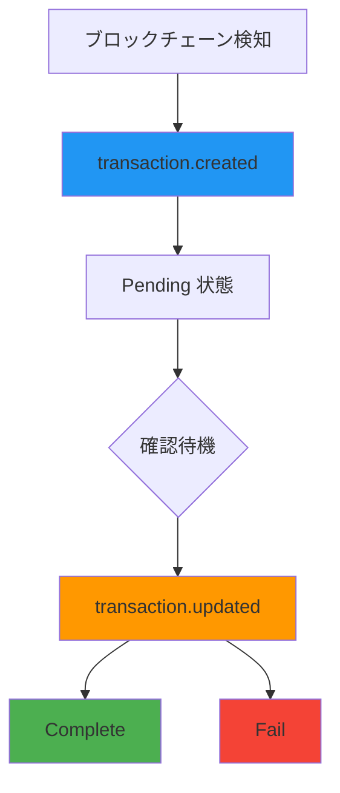

# トランザクション Webhook

> [!info] 概要 ブロックチェーンでトランザクションが検知されるか、状態が変更されるたびにリアルタイム通知を送信します。決済トランザクションのライフサイクルを追跡して正確な決済処理を保証できます。

> [!note] 全体 Webhook ガイド セキュリティ、リトライ、テスト方法など全般的なWebhook実装ガイドは[Webhook ガイド](./README)を参考してください。

## 🔔 トランザクションイベント

### 1. トランザクション作成 (`transaction.created`)

**発生時点:** ブロックチェーンでトランザクションが最初に検知される時

**コールバックURL:** `/callback/create-transaction`

```json
{
  "event": "transaction.created",
  "timestamp": "2025-09-05T10:44:52.516Z",
  "data": {
    "id": "tx-uuid-456",
    "partnerId": "834115c0-81d4-4882-ba8b-f360d86a2c47",
    "customerId": "customer-cuid-123",
    "invoiceId": "550e8400-e29b-41d4-a716-446655440000",
    "idCode": "1/0",
    "assetId": 1001,
    "from": "TEHx4cTUvJcGqidzbruvRc2fL9Tez7oHBr",
    "to": "TMxF2kPwiuS4QJo8tixV5vd4qVuo7zdtRC",
    "amount": "74.074074",
    "fee": "0",
    "balance": null,
    "state": "Pending",
    "type": "DEPOSIT",
    "detail": "d1f10b55e61d16e3616d8d0ac7c42e0edcc8a5587b251239f0a14f587032cb18",
    "blockNum": 75235898,
    "memo": null,
    "createdAt": "2025-09-05T10:44:52.516Z",
    "updatedAt": "2025-09-05T10:44:52.516Z",
    "Asset": {
      "id": 1001,
      "name": "USDT-TRX",
      "symbol": "USDT",
      "network": "TRX"
    },
    "customer": {
      "id": "customer-cuid-123",
      "name": "田中太郎"
    }
  }
}
```

### 2. トランザクション更新 (`transaction.updated`)

**発生時点:** トランザクション確認完了または失敗で最終状態変更時

**コールバックURL:** `/callback/update-transaction`

#### 成功 (Complete)

```json
{
  "event": "transaction.updated",
  "timestamp": "2025-09-05T10:45:30.000Z",
  "data": {
    "id": "tx-uuid-456",
    "state": "Complete",
    "previousState": "Pending",
    "detail": "d1f10b55e61d16e3616d8d0ac7c42e0edcc8a5587b251239f0a14f587032cb18",
    "amount": "74.074074",
    "invoiceId": "550e8400-e29b-41d4-a716-446655440000",
    "customerId": "customer-cuid-123",
    "blockConfirmations": 19,
    "finalizedAt": "2025-09-05T10:45:30.000Z",
    "Asset": {
      "id": 1001,
      "symbol": "USDT"
    }
  }
}
```

#### 失敗 (Fail)

```json
{
  "event": "transaction.updated",
  "timestamp": "2025-09-05T10:46:00.000Z",
  "data": {
    "id": "tx-uuid-456",
    "state": "Fail",
    "previousState": "Pending",
    "detail": "d1f10b55e61d16e3616d8d0ac7c42e0edcc8a5587b251239f0a14f587032cb18",
    "amount": "74.074074",
    "invoiceId": "550e8400-e29b-41d4-a716-446655440000",
    "customerId": "customer-cuid-123",
    "failureReason": "transaction_expired",
    "Asset": {
      "id": 1001,
      "symbol": "USDT"
    }
  }
}
```

---

## 📋 ペイロードフィールド説明

### transaction.created データフィールド

|フィールド|型|説明|
|---|---|---|
|`id`|string|トランザクション固有ID|
|`partnerId`|string|パートナーID|
|`customerId`|string|顧客ID|
|`invoiceId`|string|関連インボイスID|
|`assetId`|number|資産ID|
|`from`|string|送信者アドレス|
|`to`|string|受信者アドレス|
|`amount`|string|送金金額|
|`state`|string|トランザクション状態 (`Pending`)|
|`type`|string|トランザクションタイプ (`DEPOSIT`)|
|`detail`|string|ブロックチェーントランザクションハッシュ|
|`blockNum`|number|ブロック番号|
|`Asset`|object|資産情報|
|`customer`|object|顧客情報|

### transaction.updated データフィールド

|フィールド|型|説明|
|---|---|---|
|`id`|string|トランザクションID|
|`state`|string|変更された状態 (`Complete`, `Fail`)|
|`previousState`|string|前の状態|
|`blockConfirmations`|number|ブロック確認数 (成功時)|
|`finalizedAt`|string|最終確定時間|
|`failureReason`|string|失敗事由 (失敗時)|

---

## 🔄 トランザクションライフサイクル



> [!note] 状態変更過程
>
> 1. **ブロックチェーン検知**: 顧客が送金したトランザクションがブロックチェーンに記録
> 2. **Created イベント**: プラットフォームでトランザクションを検知し`transaction.created`イベント送信
> 3. **確認待機**: 設定された確認数まで待機 (TRX: 19 確認)
> 4. **Updated イベント**: 確認完了または失敗時`transaction.updated`イベント送信

---

## 🛠️ トランザクション Webhook 処理例

### Node.js 実装

```javascript
// トランザクション作成処理
app.post('/callback/create-transaction', (req, res) => {
  const { event, data } = req.body;

  if (event !== 'transaction.created') {
    return res.status(400).json({ error: 'Invalid event type' });
  }

  try {
    console.log(`新しいトランザクション検知: ${data.id}`);
    console.log(`金額: ${data.amount} ${data.Asset.symbol}`);
    console.log(`ブロック番号: ${data.blockNum}`);

    // トランザクションログ
    logTransaction(data);

    // 顧客に送金確認通知
    notifyTransactionDetected(data.customerId, data);

    // インボイス状態更新 (Pending)
    updateInvoiceStatus(data.invoiceId, 'Pending');

    res.status(200).json({ status: 'ok' });
  } catch (error) {
    console.error('トランザクション作成処理エラー:', error);
    res.status(500).json({ error: 'Processing failed' });
  }
});

// トランザクション更新処理
app.post('/callback/update-transaction', (req, res) => {
  const { event, data } = req.body;

  if (event !== 'transaction.updated') {
    return res.status(400).json({ error: 'Invalid event type' });
  }

  try {
    console.log(`トランザクション状態変更: ${data.id} → ${data.state}`);

    switch (data.state) {
      case 'Complete':
        console.log(`決済最終完了: ${data.amount} ${data.Asset.symbol}`);
        console.log(`確認数: ${data.blockConfirmations}`);

        // 決済完了処理
        finalizePayment(data.customerId, data);

        // インボイス完了処理
        completeInvoice(data.invoiceId);

        // 完了通知送信
        notifyPaymentFinalized(data.customerId, data);
        break;

      case 'Fail':
        console.log(`トランザクション失敗: ${data.failureReason}`);

        // 失敗処理
        handleTransactionFailure(data);

        // 失敗通知
        notifyTransactionFailure(data.customerId, data);
        break;
    }

    res.status(200).json({ status: 'ok' });
  } catch (error) {
    console.error('トランザクション更新処理エラー:', error);
    res.status(500).json({ error: 'Processing failed' });
  }
});

// ビジネスロジック関数
async function logTransaction(transactionData) {
  // トランザクションログ保存
  console.log('トランザクションログ保存:', transactionData.detail);
}

async function notifyTransactionDetected(customerId, data) {
  // 顧客に送金検知通知
  console.log(`顧客${customerId}に送金検知通知送信`);
}

async function updateInvoiceStatus(invoiceId, status) {
  // インボイス状態更新
  console.log(`インボイス${invoiceId}状態を${status}に変更`);
}

async function finalizePayment(customerId, data) {
  // 最終決済完了処理
  console.log(`顧客${customerId}決済最終完了処理`);
  // 例: アカウントクレジット追加、商品配送など
}

async function completeInvoice(invoiceId) {
  // インボイス完了処理
  console.log(`インボイス${invoiceId}完了処理`);
}

async function handleTransactionFailure(data) {
  // トランザクション失敗処理
  console.log(`トランザクション${data.id}失敗処理: ${data.failureReason}`);
}
```

### Python 実装

```python
from flask import Flask, request, jsonify
import logging

app = Flask(__name__)
logging.basicConfig(level=logging.INFO)

@app.route('/callback/create-transaction', methods=['POST'])
def handle_transaction_created():
    payload = request.get_json()

    if payload.get('event') != 'transaction.created':
        return jsonify({'error': 'Invalid event type'}), 400

    data = payload.get('data', {})

    try:
        transaction_id = data.get('id')
        amount = data.get('amount')
        asset_info = data.get('Asset', {})

        logging.info(f"新しいトランザクション検知: {transaction_id}")
        logging.info(f"金額: {amount} {asset_info.get('symbol')}")

        # ビジネスロジック
        log_transaction(data)
        notify_transaction_detected(data.get('customerId'), data)
        update_invoice_status(data.get('invoiceId'), 'Pending')

        return jsonify({'status': 'ok'}), 200

    except Exception as e:
        logging.error(f"トランザクション作成処理エラー: {str(e)}")
        return jsonify({'error': 'Processing failed'}), 500

@app.route('/callback/update-transaction', methods=['POST'])
def handle_transaction_updated():
    payload = request.get_json()

    if payload.get('event') != 'transaction.updated':
        return jsonify({'error': 'Invalid event type'}), 400

    data = payload.get('data', {})

    try:
        transaction_id = data.get('id')
        state = data.get('state')

        logging.info(f"トランザクション状態変更: {transaction_id} → {state}")

        if state == 'Complete':
            confirmations = data.get('blockConfirmations', 0)
            logging.info(f"決済最終完了、確認数: {confirmations}")

            finalize_payment(data.get('customerId'), data)
            complete_invoice(data.get('invoiceId'))
            notify_payment_finalized(data.get('customerId'), data)

        elif state == 'Fail':
            failure_reason = data.get('failureReason', 'unknown')
            logging.info(f"トランザクション失敗: {failure_reason}")

            handle_transaction_failure(data)
            notify_transaction_failure(data.get('customerId'), data)

        return jsonify({'status': 'ok'}), 200

    except Exception as e:
        logging.error(f"トランザクション更新処理エラー: {str(e)}")
        return jsonify({'error': 'Processing failed'}), 500

def log_transaction(data):
    """トランザクションログ保存"""
    logging.info(f"トランザクションログ保存: {data.get('detail')}")

def notify_transaction_detected(customer_id, data):
    """送金検知通知"""
    logging.info(f"顧客{customer_id}に送金検知通知送信")

def update_invoice_status(invoice_id, status):
    """インボイス状態更新"""
    logging.info(f"インボイス{invoice_id}状態を{status}に変更")

def finalize_payment(customer_id, data):
    """最終決済完了処理"""
    logging.info(f"顧客{customer_id}決済最終完了処理")

def complete_invoice(invoice_id):
    """インボイス完了処理"""
    logging.info(f"インボイス{invoice_id}完了処理")

if __name__ == '__main__':
    app.run(host='0.0.0.0', port=3000, debug=True)
```

---

## 💡 活用事例

### 1. リアルタイム決済モニタリング

```javascript
// 決済進行率追跡
const paymentProgress = {
  'invoice-123': {
    step: 'waiting',
    transactions: []
  }
};

app.post('/callback/create-transaction', (req, res) => {
  const { data } = req.body;
  const invoiceId = data.invoiceId;

  if (paymentProgress[invoiceId]) {
    paymentProgress[invoiceId].step = 'confirming';
    paymentProgress[invoiceId].transactions.push(data.id);

    // リアルタイム更新 (WebSocket, SSE など)
    broadcastPaymentUpdate(invoiceId, 'confirming');
  }

  res.status(200).json({ status: 'ok' });
});
```

### 2. 二重支払い防止

```javascript
const processedTransactions = new Set();

app.post('/callback/create-transaction', (req, res) => {
  const { data } = req.body;
  const txHash = data.detail;

  if (processedTransactions.has(txHash)) {
    console.log(`重複トランザクション検知: ${txHash}`);
    return res.status(200).json({ status: 'duplicate' });
  }

  processedTransactions.add(txHash);
  // 正常処理...
});
```

### 3. 自動返金処理

```javascript
app.post('/callback/update-transaction', (req, res) => {
  const { data } = req.body;

  if (data.state === 'Fail' && data.failureReason === 'amount_mismatch') {
    // 金額不一致時自動返金処理
    initiateRefund(data);
  }

  res.status(200).json({ status: 'ok' });
});
```

### 4. トランザクション分析

```javascript
// トランザクション統計収集
const transactionStats = {
  totalReceived: 0,
  averageAmount: 0,
  networkDistribution: {}
};

app.post('/callback/create-transaction', (req, res) => {
  const { data } = req.body;

  // 統計更新
  transactionStats.totalReceived++;

  const amount = parseFloat(data.amount);
  transactionStats.averageAmount =
    (transactionStats.averageAmount + amount) / 2;

  const network = data.Asset.network;
  transactionStats.networkDistribution[network] =
    (transactionStats.networkDistribution[network] || 0) + 1;

  res.status(200).json({ status: 'ok' });
});
```

---

## 🔗 関連ドキュメント

- [Webhook ガイド](./README) - Webhook セキュリティ及び実装ガイド
- [インボイス Webhook](./invoice) - インボイス Webhook
- [取引照会 API](../api/transaction) - 取引照会 API

#webhook #transaction #blockchain #callback #documentation