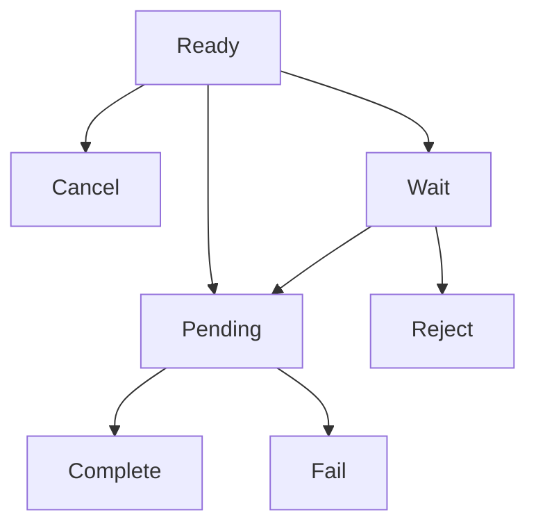

# 인보이스 API (Invoice API)

> [!info] 개요 암호화폐 결제를 위한 인보이스(결제 요청서)를 발행, 조회, 관리할 수 있는 API입니다. 고객이 결제할 수 있는 지갑 주소와 금액 정보를 포함한 결제 페이지를 제공합니다.

## 💳 인보이스 생성

새로운 결제 인보이스를 생성합니다.

### 요청

```http
POST /invoice/create
Authorization: <YOUR_API_KEY>
Content-Type: application/json
```

```json
{
  "customerName": "김민수",
  "title": "USDT 10만원 구매",
  "amount": "74.074074",
  "stdPrice": "1350.500000",
  "cashAssetId": 1,
  "cashAmount": "100000.000000",
  "cryptoAssetId": 1001,
  "expiredDate": 1800,
  "isNewAddress": false
}
```

> [!note] 요청 필드 설명

| 필드            | 타입    | 필수 | 설명                                   |
| --------------- | ------- | ---- | -------------------------------------- |
| `customerName`  | string  | ✅   | 고객 이름 (고객이 없으면 자동 생성)    |
| `title`         | string  | ✅   | 인보이스 제목                          |
| `amount`        | string  | ✅   | 클라이언트가 계산한 예상 암호화폐 수량 |
| `stdPrice`      | string  | ✅   | 요청 시점의 환율                       |
| `cashAssetId`   | number  | ✅   | 법정화폐 자산 ID (1: KRW, 2: USD)      |
| `cashAmount`    | string  | ✅   | 법정화폐 금액                          |
| `cryptoAssetId` | number  | ✅   | 암호화폐 자산 ID                       |
| `expiredDate`   | number  | ✅   | 만료 시간 (초 단위)                    |
| `isNewAddress`  | boolean | ❌   | 새 지갑 주소 생성 여부 (기본값: false) |

### 응답

```json
{
  "invoice": {
    "id": "550e8400-e29b-41d4-a716-446655440000",
    "title": "USDT 10만원 구매",
    "idCode": "1/0/0",
    "partnerId": "partner-uuid-123",
    "customerId": "customer-cuid-123",
    "cashAssetId": 1,
    "cryptoAssetId": 1001,
    "walletId": 1,
    "cashAmount": "100000.000000",
    "stdPrice": "1350.500000",
    "cryptoAmount": "74.074074",
    "expiredAt": "2025-09-05T11:00:00.000Z",
    "createdAt": "2025-09-05T10:30:00.000Z",
    "crypto": {
      "id": 1001,
      "name": "USDT-TRX",
      "symbol": "USDT",
      "network": "TRX"
    },
    "cash": {
      "id": 1,
      "name": "Korea Won",
      "symbol": "KRW",
      "network": "LEGAL"
    }
  },
  "url": "https://pay.tapayz.io/550e8400-e29b-41d4-a716-446655440000"
}
```

> [!tip] 성공 응답
>
> - `invoice`: 생성된 인보이스 정보
> - `url`: 고객이 결제를 진행할 수 있는 결제 페이지 URL

---

## 📋 인보이스 목록 조회

파트너의 인보이스 목록을 조회합니다.

### 요청

```http
GET /invoice?page=1&size=10&startAt=2025-09-01T00:00:00.000Z&endAt=2025-09-05T23:59:59.999Z&customerName=김민수
Authorization: <YOUR_API_KEY>
```

> [!note] 쿼리 파라미터

| 파라미터       | 타입   | 필수 | 설명                     |
| -------------- | ------ | ---- | ------------------------ |
| `page`         | number | ❌   | 페이지 번호 (기본값: 1)  |
| `size`         | number | ❌   | 페이지 크기 (기본값: 10) |
| `startAt`      | string | ❌   | 시작 날짜 (ISO 8601)     |
| `endAt`        | string | ❌   | 종료 날짜 (ISO 8601)     |
| `customerName` | string | ❌   | 고객 이름으로 필터링     |

### 응답

```json
{
  "total": 25,
  "totalPages": 3,
  "list": [
    {
      "id": "550e8400-e29b-41d4-a716-446655440000",
      "title": "USDT 10만원 구매",
      "state": "Complete",
      "cashAmount": "100000.000000",
      "cryptoAmount": "74.074074",
      "stdPrice": "1350.500000",
      "expiredAt": "2025-09-05T11:00:00.000Z",
      "completedAt": "2025-09-05T10:45:00.000Z",
      "createdAt": "2025-09-05T10:30:00.000Z",
      "customer": {
        "id": "customer-cuid-123",
        "name": "김민수",
        "icon": "/images/customer.svg"
      },
      "crypto": {
        "id": 1001,
        "name": "USDT-TRX",
        "symbol": "USDT",
        "network": "TRX"
      },
      "cash": {
        "id": 1,
        "name": "Korea Won",
        "symbol": "KRW",
        "network": "LEGAL"
      }
    }
  ]
}
```

---

## 🔍 인보이스 상세 조회

특정 인보이스의 상세 정보를 조회합니다.

### 요청

```http
GET /invoice/detail?id=550e8400-e29b-41d4-a716-446655440000
Authorization: <YOUR_API_KEY>
```

> [!note] 쿼리 파라미터

| 파라미터 | 타입   | 필수 | 설명        |
| -------- | ------ | ---- | ----------- |
| `id`     | string | ✅   | 인보이스 ID |

### 응답

```json
{
  "id": "550e8400-e29b-41d4-a716-446655440000",
  "state": "Complete",
  "title": "USDT 10만원 구매",
  "stdPrice": "1350.500000",
  "cashAmount": "100000.000000",
  "cryptoAmount": "74.074074",
  "expiredAt": "2025-09-05T11:00:00.000Z",
  "createdAt": "2025-09-05T10:30:00.000Z",
  "partner": {
    "name": "파트너 회사",
    "icon": "/images/partner.svg"
  },
  "customer": {
    "name": "김민수",
    "icon": "/images/customer.svg"
  },
  "cash": {
    "name": "Korea Won",
    "symbol": "KRW",
    "price": "1.000000"
  },
  "crypto": {
    "name": "USDT-TRX",
    "symbol": "USDT",
    "price": "1350.500000"
  },
  "wallet": {
    "address": "TMxF2kPwiuS4QJo8tixV5vd4qVuo7zdtRC",
    "network": "TRX"
  },
  "detail": [],
  "Transaction": [
    {
      "id": "tx-uuid-456",
      "from": "TEHx4cTUvJcGqidzbruvRc2fL9Tez7oHBr",
      "to": "TMxF2kPwiuS4QJo8tixV5vd4qVuo7zdtRC",
      "amount": "74.074074",
      "state": "Complete",
      "type": "DEPOSIT",
      "detail": "d1f10b55e61d16e3616d8d0ac7c42e0edcc8a5587b251239f0a14f587032cb18",
      "blockNum": 75235898,
      "createdAt": "2025-09-05T10:44:52.516Z"
    }
  ]
}
```

---

## 📊 인보이스 상태

### 상태 값

| 상태       | 설명             |
| ---------- | ---------------- |
| `Ready`    | 결제 대기 중     |
| `Wait`     | 처리 대기 중     |
| `Pending`  | 블록체인 확인 중 |
| `Complete` | 결제 완료        |
| `Fail`     | 결제 실패        |
| `Reject`   | 결제 거부        |
| `Cancel`   | 결제 취소 (만료) |

### 상태 흐름



> [!info] 상태 설명
>
> - **Ready**: 인보이스가 생성되어 결제 대기 중
> - **Pending**: 고객이 송금하여 블록체인에서 확인 중
> - **Complete**: 결제가 성공적으로 완료됨
> - **Cancel**: 만료 시간이 지나 자동으로 취소됨

---

## 🔔 Webhook 이벤트

인보이스 상태 변경 시 등록된 콜백 URL로 이벤트가 전송됩니다.

### 인보이스 상태 업데이트

```json
{
  "event": "invoice.updated",
  "data": {
    "invoiceId": "550e8400-e29b-41d4-a716-446655440000",
    "customerId": "customer-cuid-123",
    "state": "Complete",
    "amount": "74.074074",
    "completedAt": "2025-09-05T10:45:00.000Z"
  }
}
```

### 트랜잭션 생성

```json
{
  "event": "transaction.created",
  "data": {
    "id": "tx-uuid-456",
    "invoiceId": "550e8400-e29b-41d4-a716-446655440000",
    "customerId": "customer-cuid-123",
    "from": "TEHx4cTUvJcGqidzbruvRc2fL9Tez7oHBr",
    "to": "TMxF2kPwiuS4QJo8tixV5vd4qVuo7zdtRC",
    "amount": "74.074074",
    "state": "Pending",
    "type": "DEPOSIT",
    "detail": "d1f10b55e61d16e3616d8d0ac7c42e0edcc8a5587b251239f0a14f587032cb18"
  }
}
```

---

## ⚠️ 에러 응답

### 인증 실패

```json
{
  "statusCode": 401,
  "message": "Unauthorized",
  "timestamp": "2025-09-05T10:30:00.000Z",
  "path": "/invoice/create"
}
```

### 잘못된 요청

```json
{
  "statusCode": 400,
  "message": "Invalid Asset",
  "timestamp": "2025-09-05T10:30:00.000Z",
  "path": "/invoice/create"
}
```

### 인보이스 없음

```json
{
  "statusCode": 404,
  "message": "Invalid Invoice",
  "timestamp": "2025-09-05T10:30:00.000Z",
  "path": "/invoice/detail"
}
```

---

## 💻 사용 예시

### Node.js (axios)

```javascript
import axios from "axios";

const API_KEY = "your-api-key-here";
const BASE_URL = "https://api.crypted-pay.com";

// 인보이스 생성
async function createInvoice() {
  try {
    const response = await axios.post(
      `${BASE_URL}/invoice/create`,
      {
        customerName: "김민수",
        title: "USDT 10만원 구매",
        amount: "74.074074",
        stdPrice: "1350.500000",
        cashAssetId: 1,
        cashAmount: "100000.000000",
        cryptoAssetId: 1001,
        expiredDate: 1800,
        isNewAddress: false,
      },
      {
        headers: {
          Authorization: API_KEY,
          "Content-Type": "application/json",
        },
      }
    );

    console.log("인보이스 생성 완료:", response.data.invoice.id);
    console.log("결제 URL:", response.data.url);

    return response.data;
  } catch (error) {
    console.error("인보이스 생성 실패:", error.response?.data || error.message);
  }
}

// 인보이스 목록 조회
async function getInvoiceList(page = 1, size = 10) {
  try {
    const response = await axios.get(`${BASE_URL}/invoice`, {
      headers: {
        Authorization: API_KEY,
      },
      params: {
        page,
        size,
        startAt: "2025-09-01T00:00:00.000Z",
        endAt: "2025-09-05T23:59:59.999Z",
      },
    });

    console.log(`총 ${response.data.total}개의 인보이스`);
    console.log("인보이스 목록:", response.data.list);

    return response.data;
  } catch (error) {
    console.error(
      "인보이스 목록 조회 실패:",
      error.response?.data || error.message
    );
  }
}

// 인보이스 상세 조회
async function getInvoiceDetail(invoiceId) {
  try {
    const response = await axios.get(`${BASE_URL}/invoice/detail`, {
      headers: {
        Authorization: API_KEY,
      },
      params: {
        id: invoiceId,
      },
    });

    console.log("인보이스 상세:", response.data);
    console.log("지갑 주소:", response.data.wallet.address);

    return response.data;
  } catch (error) {
    console.error(
      "인보이스 상세 조회 실패:",
      error.response?.data || error.message
    );
  }
}
```

### Python (requests)

```python
import requests
from datetime import datetime, timedelta

API_KEY = 'your-api-key-here'
BASE_URL = 'https://api.crypted-pay.com'

headers = {
    'Authorization': API_KEY,
    'Content-Type': 'application/json'
}

# 인보이스 생성
def create_invoice():
    payload = {
        'customerName': '김민수',
        'title': 'USDT 10만원 구매',
        'amount': '74.074074',
        'stdPrice': '1350.500000',
        'cashAssetId': 1,
        'cashAmount': '100000.000000',
        'cryptoAssetId': 1001,
        'expiredDate': 1800,
        'isNewAddress': False
    }

    try:
        response = requests.post(f'{BASE_URL}/invoice/create',
                               json=payload, headers=headers)
        response.raise_for_status()

        data = response.json()
        print(f"인보이스 생성 완료: {data['invoice']['id']}")
        print(f"결제 URL: {data['url']}")

        return data
    except requests.exceptions.RequestException as e:
        print(f"인보이스 생성 실패: {e}")

# 인보이스 목록 조회
def get_invoice_list(page=1, size=10):
    params = {
        'page': page,
        'size': size,
        'startAt': '2025-09-01T00:00:00.000Z',
        'endAt': '2025-09-05T23:59:59.999Z'
    }

    try:
        response = requests.get(f'{BASE_URL}/invoice',
                              headers={'Authorization': API_KEY},
                              params=params)
        response.raise_for_status()

        data = response.json()
        print(f"총 {data['total']}개의 인보이스")

        return data
    except requests.exceptions.RequestException as e:
        print(f"인보이스 목록 조회 실패: {e}")
```

---

## ⚡ 주의사항

> [!warning] 중요 사항
>
> 1. **인증 필수**: 모든 API 호출 시 `Authorization` 헤더에 유효한 API 키가 필요합니다.
> 2. **만료 시간**: 인보이스는 설정한 만료 시간 후 자동으로 `Cancel` 상태가 됩니다.
> 3. **환율 변동**: `stdPrice`와 실제 처리 시점의 환율 차이로 인해 금액이 조정될 수 있습니다.

> [!tip] 팁
>
> - 고객이 존재하지 않으면 `customerName`으로 자동 생성됩니다.
> - `isNewAddress: true`로 설정하면 매번 새로운 지갑 주소를 생성합니다.
> - Webhook을 통해 실시간으로 결제 상태를 확인할 수 있습니다.

---

## 🔗 관련 문서

- [가격 조회 API](./price) - 가격 조회 API
- [고객 관리 API](./customer) - 고객 관리 API
- [거래 조회 API](./transaction) - 거래 조회 API
- [인보이스 Webhook](../webhook/invoice) - 인보이스 Webhook

#api #invoice #payment #cryptocurrency #documentation
