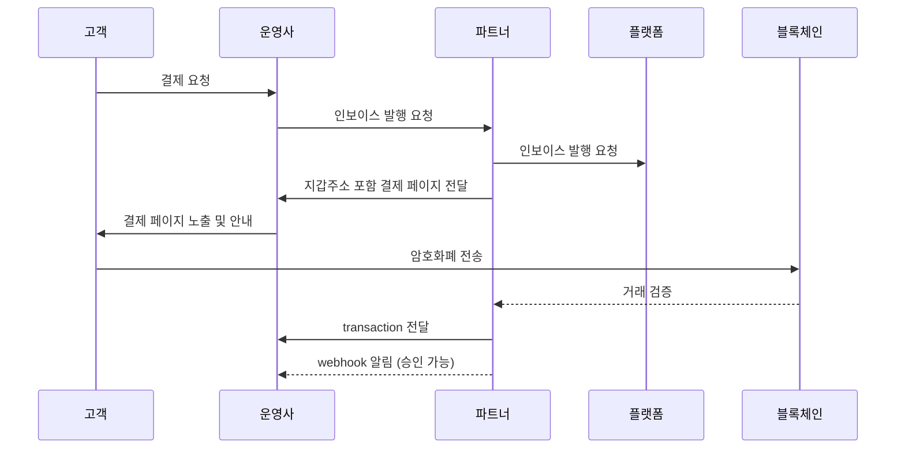

# Getting Started

Tapayz는 누구라도 쉽게 암호화폐를 이용하여 결제를 받을 수 있도록 설계된 결제 플랫폼입니다.  
이 가이드에서는 Tapayz 연동을 위한 **전체 결제 흐름**, **API Key 발급 및 사용법**, **Webhook 설정** 등을 소개합니다.

---

## 결제 흐름 상세

아래는 Tapayz의 기본 결제 처리 흐름입니다.



1. 고객이 운영사 사이트에서 결제를 요청합니다.
2. 운영사 서버는 **파트너 서버**로 인보이스 발행을 요청합니다.
3. 파트너 서버는 **플랫폼 서버**로 인보이스 발행을 요청합니다.
4. 플랫폼 서버는 **지갑 주소가 포함된 결제 페이지**를 운영사 서버로 전달합니다.
5. 운영사 서버는 고객에게 결제 페이지를 노출하고 결제 안내를 제공합니다.
6. 고객은 지정된 지갑 주소로 암호화폐를 전송합니다.
7. 네트워크 블록에 거래가 기록되면 transaction을 생성하여 운영사에게 전달합니다.
8. 네트워크 컨펌이 완료되면 거래가 최종 확정되며, webhook으로 결제 완료 상태를 전달합니다.

---

## 사전 준비

1. **파트너 계정 생성**  
   Tapayz 콘솔에서 하부 파트너 계정을 생성 후 파트너에게 전달 합니다.

2. **API KEY 발급**

   - 파트너 계정이 생성되면 API KEY가 자동 발급됩니다.
   - 발급된 키는 **콘솔 → 마이페이지 → API 정보**에서 확인할 수 있습니다.
   - API 호출 시, `Authorization` 헤더에 해당 키를 설정하여 사용합니다.

   **예시 (curl):**

   ```bash
   curl -X GET "https://api.crypted-pay.com/invoices"
   -H "Authorization: <YOUR_API_KEY>"
   ```

   **예시 (Node.js axios):**

   ```javascript
   import axios from "axios";

   const response = await axios.get("https://api.crypted-pay.com/invoices", {
     headers: { Authorization: "<YOUR_API_KEY>" },
   });

   console.log(response.data);
   ```

---

## Webhook 설정

발행된 인보이스와 거래 진행 정보를 받기 위해서는 **콜백 URL 등록**이 필요합니다.

### 콜백 이벤트 종류

| 이벤트            | 콜백 URL 예시                  | 설명                                 |
| ----------------- | ------------------------------ | ------------------------------------ |
| 인보이스 업데이트 | `/callback/update-invoice`     | 인보이스 상태 변경 시 호출           |
| 트랜잭션 생성     | `/callback/create-transaction` | 블록체인에 최초 거래가 기록되면 호출 |
| 트랜잭션 업데이트 | `/callback/update-transaction` | 컨펌 완료 및 최종 상태 업데이트      |

### Webhook JSON 예시

**`/callback/update-invoice`**

```json
{
  "state": "Pending",
  "customerId": 7,
  "invoiceId": "156c43e3-02f5-47f3-b28c-...",
  "amount": "1.228607"
}
```

**`/callback/create-transaction`**

```json
{
  "id": "1",
  "partnerId": "834115c0-81d4-4882-ba8b-f360d86a2c47",
  "customerId": 7,
  "invoiceId": "156c43e3-02f5-47f3-b28c-6bf6c511d796",
  "idCode": "1/0",
  "assetId": 1001,
  "from": "TEHx4cTUvJcGqidzbruvRc2fL9Tez7oHBr",
  "to": "TMxF2kPwiuS4QJo8tixV5vd4qVuo7zdtRC",
  "amount": "1.229",
  "fee": "0",
  "balance": null,
  "state": "Pending",
  "type": "DEPOSIT",
  "detail": "d1f10b55e61d16e3616d8d0ac7c42e0edcc8a5587b251239f0a14f587032cb18",
  "blockNum": 75235898,
  "memo": null,
  "createdAt": "2025-08-28T07:44:52.516Z",
  "updatedAt": "2025-08-28T07:44:52.516Z"
}
```

**`/callback/update-transaction`**

```json
{
  "id": "tx_4f5d9a",
  "state": "Complete",
  "detail": "d1f10b55e61d16e3...",
  "amount": "1.228607"
}
```

---

## 다음 단계

- [Quick Flow](./quickflow.md) 따라하기
