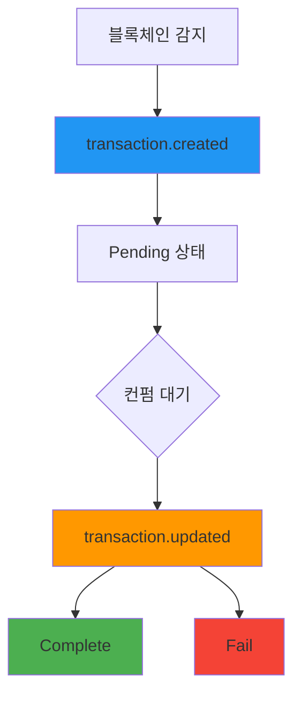

# 트랜잭션 Webhook

> [!info] 개요 블록체인에서 트랜잭션이 감지되거나 상태가 변경될 때마다 실시간 알림을 전송합니다. 결제 트랜잭션의 생명주기를 추적하여 정확한 결제 처리를 보장할 수 있습니다.

> [!note] 전체 Webhook 가이드 보안, 재시도, 테스트 방법 등 전반적인 Webhook 구현 가이드는 [Webhook 가이드](./README)를 참고하세요.

## 🔔 트랜잭션 이벤트

### 1. 트랜잭션 생성 (`transaction.created`)

**발생 시점:** 블록체인에서 트랜잭션이 최초 감지될 때

**콜백 URL:** `/callback/create-transaction`

```json
{
  "event": "transaction.created",
  "timestamp": "2025-09-05T10:44:52.516Z",
  "data": {
    "id": "tx-uuid-456",
    "partnerId": "834115c0-81d4-4882-ba8b-f360d86a2c47",
    "customerId": "customer-cuid-123",
    "invoiceId": "550e8400-e29b-41d4-a716-446655440000",
    "idCode": "1/0",
    "assetId": 1001,
    "from": "TEHx4cTUvJcGqidzbruvRc2fL9Tez7oHBr",
    "to": "TMxF2kPwiuS4QJo8tixV5vd4qVuo7zdtRC",
    "amount": "74.074074",
    "fee": "0",
    "balance": null,
    "state": "Pending",
    "type": "DEPOSIT",
    "detail": "d1f10b55e61d16e3616d8d0ac7c42e0edcc8a5587b251239f0a14f587032cb18",
    "blockNum": 75235898,
    "memo": null,
    "createdAt": "2025-09-05T10:44:52.516Z",
    "updatedAt": "2025-09-05T10:44:52.516Z",
    "Asset": {
      "id": 1001,
      "name": "USDT-TRX",
      "symbol": "USDT",
      "network": "TRX"
    },
    "customer": {
      "id": "customer-cuid-123",
      "name": "김민수"
    }
  }
}
```

### 2. 트랜잭션 업데이트 (`transaction.updated`)

**발생 시점:** 트랜잭션 컨펌 완료 또는 실패로 최종 상태 변경 시

**콜백 URL:** `/callback/update-transaction`

#### 성공 (Complete)

```json
{
  "event": "transaction.updated",
  "timestamp": "2025-09-05T10:45:30.000Z",
  "data": {
    "id": "tx-uuid-456",
    "state": "Complete",
    "previousState": "Pending",
    "detail": "d1f10b55e61d16e3616d8d0ac7c42e0edcc8a5587b251239f0a14f587032cb18",
    "amount": "74.074074",
    "invoiceId": "550e8400-e29b-41d4-a716-446655440000",
    "customerId": "customer-cuid-123",
    "blockConfirmations": 19,
    "finalizedAt": "2025-09-05T10:45:30.000Z",
    "Asset": {
      "id": 1001,
      "symbol": "USDT"
    }
  }
}
```

#### 실패 (Fail)

```json
{
  "event": "transaction.updated",
  "timestamp": "2025-09-05T10:46:00.000Z",
  "data": {
    "id": "tx-uuid-456",
    "state": "Fail",
    "previousState": "Pending",
    "detail": "d1f10b55e61d16e3616d8d0ac7c42e0edcc8a5587b251239f0a14f587032cb18",
    "amount": "74.074074",
    "invoiceId": "550e8400-e29b-41d4-a716-446655440000",
    "customerId": "customer-cuid-123",
    "failureReason": "transaction_expired",
    "Asset": {
      "id": 1001,
      "symbol": "USDT"
    }
  }
}
```

---

## 📋 페이로드 필드 설명

### transaction.created 데이터 필드

|필드|타입|설명|
|---|---|---|
|`id`|string|트랜잭션 고유 ID|
|`partnerId`|string|파트너 ID|
|`customerId`|string|고객 ID|
|`invoiceId`|string|관련 인보이스 ID|
|`assetId`|number|자산 ID|
|`from`|string|송신자 주소|
|`to`|string|수신자 주소|
|`amount`|string|송금 금액|
|`state`|string|트랜잭션 상태 (`Pending`)|
|`type`|string|트랜잭션 타입 (`DEPOSIT`)|
|`detail`|string|블록체인 트랜잭션 해시|
|`blockNum`|number|블록 번호|
|`Asset`|object|자산 정보|
|`customer`|object|고객 정보|

### transaction.updated 데이터 필드

|필드|타입|설명|
|---|---|---|
|`id`|string|트랜잭션 ID|
|`state`|string|변경된 상태 (`Complete`, `Fail`)|
|`previousState`|string|이전 상태|
|`blockConfirmations`|number|블록 컨펌 수 (성공 시)|
|`finalizedAt`|string|최종 확정 시간|
|`failureReason`|string|실패 사유 (실패 시)|

---

## 🔄 트랜잭션 생명주기



> [!note] 상태 변경 과정
> 
> 1. **블록체인 감지**: 고객이 송금한 트랜잭션이 블록체인에 기록됨
> 2. **Created 이벤트**: 플랫폼에서 트랜잭션을 감지하고 `transaction.created` 이벤트 발송
> 3. **컨펌 대기**: 설정된 컨펌 수만큼 대기 (TRX: 19 컨펌)
> 4. **Updated 이벤트**: 컨펌 완료 또는 실패 시 `transaction.updated` 이벤트 발송

---

## 🛠️ 트랜잭션 Webhook 처리 예시

### Node.js 구현

```javascript
// 트랜잭션 생성 처리
app.post('/callback/create-transaction', (req, res) => {
  const { event, data } = req.body;
  
  if (event !== 'transaction.created') {
    return res.status(400).json({ error: 'Invalid event type' });
  }
  
  try {
    console.log(`새 트랜잭션 감지: ${data.id}`);
    console.log(`금액: ${data.amount} ${data.Asset.symbol}`);
    console.log(`블록 번호: ${data.blockNum}`);
    
    // 트랜잭션 로깅
    logTransaction(data);
    
    // 고객에게 송금 확인 알림
    notifyTransactionDetected(data.customerId, data);
    
    // 인보이스 상태 업데이트 (Pending)
    updateInvoiceStatus(data.invoiceId, 'Pending');
    
    res.status(200).json({ status: 'ok' });
  } catch (error) {
    console.error('트랜잭션 생성 처리 오류:', error);
    res.status(500).json({ error: 'Processing failed' });
  }
});

// 트랜잭션 업데이트 처리
app.post('/callback/update-transaction', (req, res) => {
  const { event, data } = req.body;
  
  if (event !== 'transaction.updated') {
    return res.status(400).json({ error: 'Invalid event type' });
  }
  
  try {
    console.log(`트랜잭션 상태 변경: ${data.id} → ${data.state}`);
    
    switch (data.state) {
      case 'Complete':
        console.log(`결제 최종 완료: ${data.amount} ${data.Asset.symbol}`);
        console.log(`컨펌 수: ${data.blockConfirmations}`);
        
        // 결제 완료 처리
        finalizePayment(data.customerId, data);
        
        // 인보이스 완료 처리
        completeInvoice(data.invoiceId);
        
        // 완료 알림 전송
        notifyPaymentFinalized(data.customerId, data);
        break;
        
      case 'Fail':
        console.log(`트랜잭션 실패: ${data.failureReason}`);
        
        // 실패 처리
        handleTransactionFailure(data);
        
        // 실패 알림
        notifyTransactionFailure(data.customerId, data);
        break;
    }
    
    res.status(200).json({ status: 'ok' });
  } catch (error) {
    console.error('트랜잭션 업데이트 처리 오류:', error);
    res.status(500).json({ error: 'Processing failed' });
  }
});

// 비즈니스 로직 함수들
async function logTransaction(transactionData) {
  // 트랜잭션 로그 저장
  console.log('트랜잭션 로그 저장:', transactionData.detail);
}

async function notifyTransactionDetected(customerId, data) {
  // 고객에게 송금 감지 알림
  console.log(`고객 ${customerId}에게 송금 감지 알림 전송`);
}

async function updateInvoiceStatus(invoiceId, status) {
  // 인보이스 상태 업데이트
  console.log(`인보이스 ${invoiceId} 상태를 ${status}로 변경`);
}

async function finalizePayment(customerId, data) {
  // 최종 결제 완료 처리
  console.log(`고객 ${customerId} 결제 최종 완료 처리`);
  // 예: 계정 크레딧 추가, 상품 배송 등
}

async function completeInvoice(invoiceId) {
  // 인보이스 완료 처리
  console.log(`인보이스 ${invoiceId} 완료 처리`);
}

async function handleTransactionFailure(data) {
  // 트랜잭션 실패 처리
  console.log(`트랜잭션 ${data.id} 실패 처리: ${data.failureReason}`);
}
```

### Python 구현

```python
from flask import Flask, request, jsonify
import logging

app = Flask(__name__)
logging.basicConfig(level=logging.INFO)

@app.route('/callback/create-transaction', methods=['POST'])
def handle_transaction_created():
    payload = request.get_json()
    
    if payload.get('event') != 'transaction.created':
        return jsonify({'error': 'Invalid event type'}), 400
    
    data = payload.get('data', {})
    
    try:
        transaction_id = data.get('id')
        amount = data.get('amount')
        asset_info = data.get('Asset', {})
        
        logging.info(f"새 트랜잭션 감지: {transaction_id}")
        logging.info(f"금액: {amount} {asset_info.get('symbol')}")
        
        # 비즈니스 로직
        log_transaction(data)
        notify_transaction_detected(data.get('customerId'), data)
        update_invoice_status(data.get('invoiceId'), 'Pending')
        
        return jsonify({'status': 'ok'}), 200
        
    except Exception as e:
        logging.error(f"트랜잭션 생성 처리 오류: {str(e)}")
        return jsonify({'error': 'Processing failed'}), 500

@app.route('/callback/update-transaction', methods=['POST'])
def handle_transaction_updated():
    payload = request.get_json()
    
    if payload.get('event') != 'transaction.updated':
        return jsonify({'error': 'Invalid event type'}), 400
    
    data = payload.get('data', {})
    
    try:
        transaction_id = data.get('id')
        state = data.get('state')
        
        logging.info(f"트랜잭션 상태 변경: {transaction_id} → {state}")
        
        if state == 'Complete':
            confirmations = data.get('blockConfirmations', 0)
            logging.info(f"결제 최종 완료, 컨펌 수: {confirmations}")
            
            finalize_payment(data.get('customerId'), data)
            complete_invoice(data.get('invoiceId'))
            notify_payment_finalized(data.get('customerId'), data)
            
        elif state == 'Fail':
            failure_reason = data.get('failureReason', 'unknown')
            logging.info(f"트랜잭션 실패: {failure_reason}")
            
            handle_transaction_failure(data)
            notify_transaction_failure(data.get('customerId'), data)
        
        return jsonify({'status': 'ok'}), 200
        
    except Exception as e:
        logging.error(f"트랜잭션 업데이트 처리 오류: {str(e)}")
        return jsonify({'error': 'Processing failed'}), 500

def log_transaction(data):
    """트랜잭션 로그 저장"""
    logging.info(f"트랜잭션 로그 저장: {data.get('detail')}")

def notify_transaction_detected(customer_id, data):
    """송금 감지 알림"""
    logging.info(f"고객 {customer_id}에게 송금 감지 알림 전송")

def update_invoice_status(invoice_id, status):
    """인보이스 상태 업데이트"""
    logging.info(f"인보이스 {invoice_id} 상태를 {status}로 변경")

def finalize_payment(customer_id, data):
    """최종 결제 완료 처리"""
    logging.info(f"고객 {customer_id} 결제 최종 완료 처리")

def complete_invoice(invoice_id):
    """인보이스 완료 처리"""
    logging.info(f"인보이스 {invoice_id} 완료 처리")

if __name__ == '__main__':
    app.run(host='0.0.0.0', port=3000, debug=True)
```

---

## 💡 활용 사례

### 1. 실시간 결제 모니터링

```javascript
// 결제 진행률 추적
const paymentProgress = {
  'invoice-123': {
    step: 'waiting',
    transactions: []
  }
};

app.post('/callback/create-transaction', (req, res) => {
  const { data } = req.body;
  const invoiceId = data.invoiceId;
  
  if (paymentProgress[invoiceId]) {
    paymentProgress[invoiceId].step = 'confirming';
    paymentProgress[invoiceId].transactions.push(data.id);
    
    // 실시간 업데이트 (WebSocket, SSE 등)
    broadcastPaymentUpdate(invoiceId, 'confirming');
  }
  
  res.status(200).json({ status: 'ok' });
});
```

### 2. 이중 지불 방지

```javascript
const processedTransactions = new Set();

app.post('/callback/create-transaction', (req, res) => {
  const { data } = req.body;
  const txHash = data.detail;
  
  if (processedTransactions.has(txHash)) {
    console.log(`중복 트랜잭션 감지: ${txHash}`);
    return res.status(200).json({ status: 'duplicate' });
  }
  
  processedTransactions.add(txHash);
  // 정상 처리...
});
```

### 3. 자동 환불 처리

```javascript
app.post('/callback/update-transaction', (req, res) => {
  const { data } = req.body;
  
  if (data.state === 'Fail' && data.failureReason === 'amount_mismatch') {
    // 금액 불일치 시 자동 환불 처리
    initiateRefund(data);
  }
  
  res.status(200).json({ status: 'ok' });
});
```

### 4. 트랜잭션 분석

```javascript
// 트랜잭션 통계 수집
const transactionStats = {
  totalReceived: 0,
  averageAmount: 0,
  networkDistribution: {}
};

app.post('/callback/create-transaction', (req, res) => {
  const { data } = req.body;
  
  // 통계 업데이트
  transactionStats.totalReceived++;
  
  const amount = parseFloat(data.amount);
  transactionStats.averageAmount = 
    (transactionStats.averageAmount + amount) / 2;
  
  const network = data.Asset.network;
  transactionStats.networkDistribution[network] = 
    (transactionStats.networkDistribution[network] || 0) + 1;
  
  res.status(200).json({ status: 'ok' });
});
```

---

## 🔗 관련 문서

- [Webhook 가이드](./README) - Webhook 보안 및 구현 가이드
- [인보이스 Webhook](./invoice) - 인보이스 Webhook
- [거래 조회 API](../api/transaction) - 거래 조회 API

#webhook #transaction #blockchain #callback #documentation