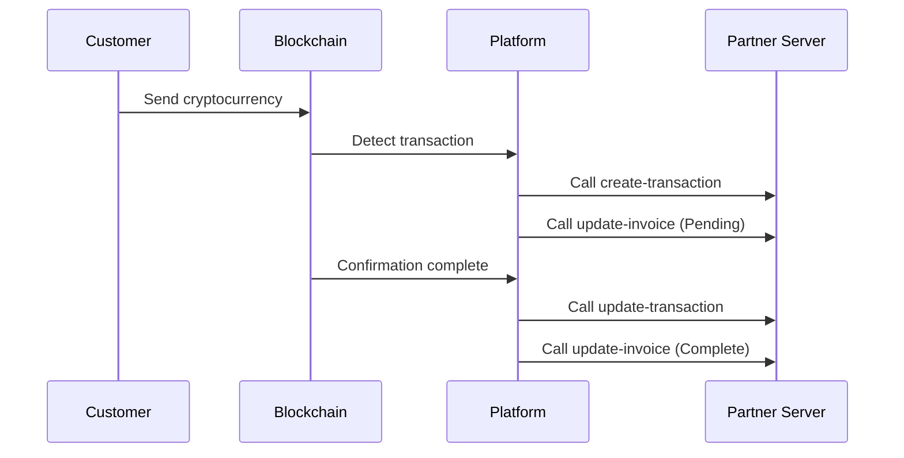

# Webhook

> [!info] Overview
> Tapayz's Webhook system is an HTTP callback mechanism that provides real-time notifications of various events during the payment process. Notifications are sent to registered endpoints whenever events such as invoice status changes, transaction creation/updates occur.

## 🔔 Webhook Types

### Supported Events

| Event                    | Callback URL                   | Description                                                               |
| ------------------------ | ------------------------------ | ------------------------------------------------------------------------- |
| **Invoice Update**       | `/callback/update-invoice`     | Called when invoice status changes                                        |
| **Transaction Creation** | `/callback/create-transaction` | Called when transaction is first recorded on blockchain                   |
| **Transaction Update**   | `/callback/update-transaction` | Called when transaction confirmation is complete and final status changes |

### Event Flow



---

## 📨 Common Payload Structure

All webhook events follow this basic structure:

```json
{
  "event": "event_type",
  "timestamp": "2025-09-05T10:45:00.000Z",
  "data": {
    // Event-specific data
  }
}
```

### Common Fields

| Field       | Type   | Description                      |
| ----------- | ------ | -------------------------------- |
| `event`     | string | Event type                       |
| `timestamp` | string | Event occurrence time (ISO 8601) |
| `data`      | object | Event-specific detailed data     |

---

## 🔒 Security and Authentication

### 1. Signature Verification

> [!warning] Required Security Measure
> We strongly recommend implementing HMAC-SHA256 signature verification to confirm the authenticity of webhook requests.

**Signature Generation Method:**

```javascript
const crypto = require("crypto");

const signature = crypto
  .createHmac("sha256", WEBHOOK_SECRET)
  .update(JSON.stringify(payload))
  .digest("hex");
```

**Verification Implementation:**

```javascript
function verifySignature(payload, signature, secret) {
  const hash = crypto
    .createHmac("sha256", secret)
    .update(JSON.stringify(payload))
    .digest("hex");

  return crypto.timingSafeEqual(
    Buffer.from(signature, "hex"),
    Buffer.from(hash, "hex")
  );
}

// Usage example
app.post("/callback/*", (req, res) => {
  const signature = req.headers["x-signature"];
  const isValid = verifySignature(
    req.body,
    signature,
    process.env.WEBHOOK_SECRET
  );

  if (!isValid) {
    return res.status(401).json({ error: "Invalid signature" });
  }

  // Webhook processing logic
});
```

### 2. IP Whitelist

Restrict webhook reception to specific IP addresses only:

```javascript
const allowedIPs = ["52.78.123.45", "13.125.67.89"]; // Platform server IPs

app.use("/callback", (req, res, next) => {
  const clientIP = req.ip || req.connection.remoteAddress;

  if (!allowedIPs.includes(clientIP)) {
    return res.status(403).json({ error: "Forbidden IP" });
  }

  next();
});
```

---

## ⚡ Best Practices

### 1. Ensure Idempotency

Since the same event may be sent multiple times, ensure idempotency:

```javascript
const processedEvents = new Set();

app.post("/callback/*", (req, res) => {
  // Generate unique event identifier
  const eventId = generateEventId(req.body);

  if (processedEvents.has(eventId)) {
    return res.status(200).json({ status: "already_processed" });
  }

  try {
    processEvent(req.body);
    processedEvents.add(eventId);
    res.status(200).json({ status: "ok" });
  } catch (error) {
    res.status(500).json({ error: "Processing failed" });
  }
});

function generateEventId(payload) {
  // Generate unique ID with event type and key identifiers
  switch (payload.event) {
    case "invoice.updated":
      return `${payload.data.invoiceId}-${payload.data.state}-${payload.timestamp}`;
    case "transaction.created":
    case "transaction.updated":
      return `${payload.data.id}-${payload.data.state}-${payload.timestamp}`;
    default:
      return `${payload.event}-${payload.timestamp}`;
  }
}
```

### 2. Asynchronous Processing

Separate heavy work to background for fast response guarantee:

```javascript
const Queue = require("bull"); // Or other queue system
const webhookQueue = new Queue("webhook processing");

app.post("/callback/*", (req, res) => {
  // Quick response
  res.status(200).json({ status: "received" });

  // Background processing
  webhookQueue.add("process-webhook", req.body);
});

// Actual processing in worker
webhookQueue.process("process-webhook", async (job) => {
  const payload = job.data;
  await processWebhookEvent(payload);
});
```

### 3. Retry Mechanism

```javascript
async function processEventWithRetry(eventData, maxRetries = 3) {
  for (let attempt = 1; attempt <= maxRetries; attempt++) {
    try {
      await processEvent(eventData);
      return { success: true };
    } catch (error) {
      console.error(`Retry ${attempt}/${maxRetries} failed:`, error);

      if (attempt === maxRetries) {
        // Final failure - save to dead letter queue
        await saveToDeadLetterQueue(eventData, error);
        throw error;
      }

      // Exponential backoff (1s, 2s, 4s...)
      await new Promise((resolve) =>
        setTimeout(resolve, Math.pow(2, attempt) * 1000)
      );
    }
  }
}
```

### 4. Logging and Monitoring

```javascript
const winston = require("winston");

const logger = winston.createLogger({
  level: "info",
  format: winston.format.combine(
    winston.format.timestamp(),
    winston.format.json()
  ),
  transports: [new winston.transports.File({ filename: "webhook.log" })],
});

app.post("/callback/*", (req, res) => {
  const startTime = Date.now();
  const payload = req.body;

  logger.info("Webhook received", {
    event: payload.event,
    path: req.path,
    userAgent: req.headers["user-agent"],
    ip: req.ip,
  });

  try {
    processEvent(payload);

    const duration = Date.now() - startTime;
    logger.info("Webhook processing complete", {
      event: payload.event,
      duration: `${duration}ms`,
      status: "success",
    });

    res.status(200).json({ status: "ok" });
  } catch (error) {
    logger.error("Webhook processing failed", {
      event: payload.event,
      error: error.message,
      stack: error.stack,
    });

    res.status(500).json({ error: "Processing failed" });
  }
});
```

---

## 🔧 Testing and Debugging

### Local Development Environment Setup

**1. Local tunneling with ngrok:**

```bash
# After installing ngrok
ngrok http 3000

# Register the output URL as webhook URL
# Example: https://abc123.ngrok.io/callback/update-invoice
```

**2. Test server configuration:**

```javascript
const express = require("express");
const app = express();

app.use(express.json());

// Log all webhook events
app.post("/callback/*", (req, res) => {
  console.log("=== Webhook Received ===");
  console.log("Path:", req.path);
  console.log("Headers:", req.headers);
  console.log("Body:", JSON.stringify(req.body, null, 2));
  console.log("=======================");

  res.status(200).json({ status: "ok" });
});

app.listen(3000, () => {
  console.log("Test server running on port 3000");
});
```

### Manual Testing

Manual testing to verify webhook behavior:

```bash
# Invoice update test
curl -X POST http://localhost:3000/callback/update-invoice \
  -H "Content-Type: application/json" \
  -H "X-Signature: test-signature" \
  -d '{
    "event": "invoice.updated",
    "timestamp": "2025-09-05T10:45:00.000Z",
    "data": {
      "invoiceId": "test-invoice-123",
      "state": "Complete"
    }
  }'

# Transaction creation test
curl -X POST http://localhost:3000/callback/create-transaction \
  -H "Content-Type: application/json" \
  -d '{
    "event": "transaction.created",
    "timestamp": "2025-09-05T10:44:52.516Z",
    "data": {
      "id": "test-tx-456",
      "state": "Pending"
    }
  }'
```

---

## 📊 Monitoring and Alerts

### Performance Metrics

Key indicators to monitor:

```javascript
const metrics = {
  webhookReceived: 0,
  webhookProcessed: 0,
  webhookFailed: 0,
  averageProcessingTime: 0,
};

// Metrics collection
app.post("/callback/*", (req, res) => {
  const startTime = Date.now();
  metrics.webhookReceived++;

  try {
    processEvent(req.body);
    metrics.webhookProcessed++;

    const duration = Date.now() - startTime;
    metrics.averageProcessingTime =
      (metrics.averageProcessingTime + duration) / 2;

    res.status(200).json({ status: "ok" });
  } catch (error) {
    metrics.webhookFailed++;
    res.status(500).json({ error: "Processing failed" });
  }
});

// Metrics endpoint
app.get("/metrics", (req, res) => {
  res.json(metrics);
});
```

### Health Check

```javascript
app.get("/health", (req, res) => {
  const health = {
    status: "healthy",
    timestamp: new Date().toISOString(),
    uptime: process.uptime(),
    memory: process.memoryUsage(),
    webhookStatus: {
      received: metrics.webhookReceived,
      processed: metrics.webhookProcessed,
      failed: metrics.webhookFailed,
      successRate:
        metrics.webhookReceived > 0
          ? (
              (metrics.webhookProcessed / metrics.webhookReceived) *
              100
            ).toFixed(2)
          : 0,
    },
  };

  res.json(health);
});
```

---

## ⚠️ Important Notes

> [!warning] Critical Information
>
> 1. **Response Time**: Webhook handlers must respond within **5 seconds**.
> 2. **Status Code**: Must return **200** status code on success.
> 3. **Retries**: Up to **3 retries** on failure.
> 4. **Order**: Event order may not be guaranteed.
> 5. **Duplicates**: Same event may be sent multiple times.

> [!tip] Tips
>
> - Always separate heavy processing to background tasks.
> - Use database transactions to ensure consistency.
> - Test thoroughly in test environment before production.
> - Prepare alternative query methods for webhook failures.

---

## 🔗 Related Documentation

- [Invoice Webhook](./invoice) - Invoice Webhook Details
- [Transaction Webhook](./transaction) - Transaction Webhook Details
- [Invoice API](../api/invoice) - Invoice API
- [Transaction API](../api/transaction) - Transaction Query API

#webhook #callback #security #monitoring #documentation
