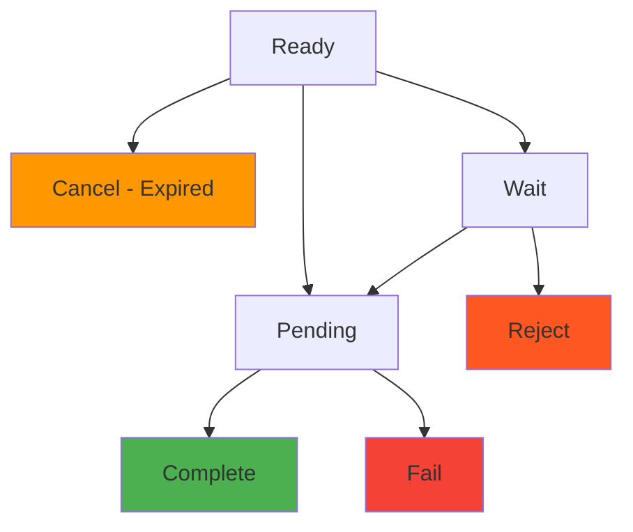

# Invoice Webhook

> [!info] Overview Invoice status changes trigger real-time notifications to the `/callback/update-invoice` endpoint. You can immediately detect status changes such as payment completion, expiration, and failure to process business logic.

> [!note] Complete Webhook Guide For comprehensive webhook implementation guidance including security, retry mechanisms, and testing methods, please refer to [Webhook README](./README).

## 🔔 Invoice Events

### Event Type: `invoice.updated`

**Trigger Points:**

- When a customer completes payment (`Ready` → `Pending` → `Complete`)
- When an invoice expires (`Ready` → `Cancel`)
- When payment fails (`Pending` → `Fail`)
- When payment is rejected (`Wait` → `Reject`)

### Status Change Flow



> [!note] Webhook Delivery by Status
>
> - **Ready → Pending**: When customer initiates transfer
> - **Pending → Complete**: When blockchain confirmation is completed
> - **Pending → Fail**: When amount mismatch or transaction failure occurs
> - **Ready → Cancel**: When expiration time is reached (scheduler checks every minute)

---

## 📨 Webhook Payload

### Payment Complete (Complete)

```json
{
  "event": "invoice.updated",
  "timestamp": "2025-09-05T10:45:00.000Z",
  "data": {
    "invoiceId": "550e8400-e29b-41d4-a716-446655440000",
    "customerId": "customer-cuid-123",
    "customerName": "김민수",
    "state": "Complete",
    "previousState": "Pending",
    "title": "USDT 10만원 구매",
    "cashAmount": "100000.000000",
    "cryptoAmount": "74.074074",
    "cashAssetId": 1,
    "cryptoAssetId": 1001,
    "completedAt": "2025-09-05T10:45:00.000Z",
    "createdAt": "2025-09-05T10:30:00.000Z",
    "transaction": {
      "id": "tx-uuid-456",
      "detail": "d1f10b55e61d16e3616d8d0ac7c42e0edcc8a5587b251239f0a14f587032cb18",
      "from": "TEHx4cTUvJcGqidzbruvRc2fL9Tez7oHBr",
      "to": "TMxF2kPwiuS4QJo8tixV5vd4qVuo7zdtRC",
      "blockNum": 75235898
    }
  }
}
```

### Payment Pending (Pending)

```json
{
  "event": "invoice.updated",
  "timestamp": "2025-09-05T10:44:52.516Z",
  "data": {
    "invoiceId": "550e8400-e29b-41d4-a716-446655440000",
    "customerId": "customer-cuid-123",
    "customerName": "김민수",
    "state": "Pending",
    "previousState": "Ready",
    "title": "USDT 10만원 구매",
    "cashAmount": "100000.000000",
    "cryptoAmount": "74.074074",
    "transaction": {
      "id": "tx-uuid-456",
      "detail": "d1f10b55e61d16e3616d8d0ac7c42e0edcc8a5587b251239f0a14f587032cb18"
    }
  }
}
```

### Payment Expired (Cancel)

```json
{
  "event": "invoice.updated",
  "timestamp": "2025-09-05T11:00:00.000Z",
  "data": {
    "invoiceId": "550e8400-e29b-41d4-a716-446655440000",
    "customerId": "customer-cuid-123",
    "customerName": "김민수",
    "state": "Cancel",
    "previousState": "Ready",
    "title": "USDT 10만원 구매",
    "expiredAt": "2025-09-05T11:00:00.000Z",
    "reason": "expired"
  }
}
```

### Payment Failed (Fail)

```json
{
  "event": "invoice.updated",
  "timestamp": "2025-09-05T10:50:00.000Z",
  "data": {
    "invoiceId": "550e8400-e29b-41d4-a716-446655440000",
    "customerId": "customer-cuid-123",
    "customerName": "김민수",
    "state": "Fail",
    "previousState": "Pending",
    "title": "USDT 10만원 구매",
    "reason": "amount_mismatch",
    "transaction": {
      "id": "tx-uuid-456",
      "detail": "d1f10b55e61d16e3616d8d0ac7c42e0edcc8a5587b251239f0a14f587032cb18",
      "receivedAmount": "70.000000",
      "expectedAmount": "74.074074"
    }
  }
}
```

---

## 📋 Payload Field Description

### Data Fields

|Field|Type|Description|
|---|---|---|
|`invoiceId`|string|Invoice ID|
|`customerId`|string|Customer ID|
|`customerName`|string|Customer name|
|`state`|string|Changed status|
|`previousState`|string|Previous status|
|`title`|string|Invoice title|
|`cashAmount`|string|Fiat currency amount|
|`cryptoAmount`|string|Cryptocurrency amount|
|`cashAssetId`|number|Fiat currency asset ID|
|`cryptoAssetId`|number|Cryptocurrency asset ID|
|`completedAt`|string|Completion time (when status is Complete)|
|`expiredAt`|string|Expiration time (when status is Cancel)|
|`reason`|string|Reason for status change|
|`transaction`|object|Related transaction information|

---

## 🛠️ Invoice Webhook Processing Examples

### Node.js Implementation

```javascript
app.post('/callback/update-invoice', (req, res) => {
  const { event, data } = req.body;

  if (event !== 'invoice.updated') {
    return res.status(400).json({ error: 'Invalid event type' });
  }

  try {
    // Process business logic by status
    switch (data.state) {
      case 'Pending':
        console.log(`Payment in progress: ${data.invoiceId}`);
        notifyCustomer(data.customerId, 'payment_pending');
        break;

      case 'Complete':
        console.log(`Payment completed: ${data.invoiceId}, Amount: ${data.cashAmount}`);
        // Add credit to user account
        addUserCredit(data.customerName, parseFloat(data.cashAmount));
        sendPaymentConfirmation(data.customerId, data);
        break;

      case 'Fail':
        console.log(`Payment failed: ${data.invoiceId}, Reason: ${data.reason}`);
        notifyPaymentFailure(data.customerId, data.reason);
        break;

      case 'Cancel':
        console.log(`Payment expired: ${data.invoiceId}`);
        notifyPaymentExpired(data.customerId);
        break;
    }

    res.status(200).json({ status: 'ok' });
  } catch (error) {
    console.error('Webhook processing error:', error);
    res.status(500).json({ error: 'Internal server error' });
  }
});

// Business logic functions
async function addUserCredit(username, amount) {
  console.log(`Adding ${amount} credit to user ${username}`);
  // Example: await db.user.update({ username }, { $inc: { credit: amount } });
}

async function notifyCustomer(customerId, type) {
  console.log(`Sending ${type} notification to customer ${customerId}`);
}
```

### Python Implementation

```python
from flask import Flask, request, jsonify
import logging

app = Flask(__name__)
logging.basicConfig(level=logging.INFO)

@app.route('/callback/update-invoice', methods=['POST'])
def handle_invoice_update():
    payload = request.get_json()

    if payload.get('event') != 'invoice.updated':
        return jsonify({'error': 'Invalid event type'}), 400

    data = payload.get('data', {})

    try:
        state = data.get('state')
        invoice_id = data.get('invoiceId')
        customer_name = data.get('customerName')

        if state == 'Pending':
            logging.info(f"Payment in progress: {invoice_id}")
            notify_customer(data.get('customerId'), 'payment_pending')

        elif state == 'Complete':
            cash_amount = float(data.get('cashAmount', 0))
            logging.info(f"Payment completed: {invoice_id}, Amount: {cash_amount}")
            add_user_credit(customer_name, cash_amount)
            send_payment_confirmation(data.get('customerId'), data)

        elif state == 'Fail':
            reason = data.get('reason', 'unknown')
            logging.info(f"Payment failed: {invoice_id}, Reason: {reason}")
            notify_payment_failure(data.get('customerId'), reason)

        elif state == 'Cancel':
            logging.info(f"Payment expired: {invoice_id}")
            notify_payment_expired(data.get('customerId'))

        return jsonify({'status': 'ok'}), 200

    except Exception as e:
        logging.error(f"Webhook processing error: {str(e)}")
        return jsonify({'error': 'Internal server error'}), 500

def add_user_credit(username, amount):
    """Add user credit"""
    logging.info(f"Adding {amount} credit to user {username}")

def notify_customer(customer_id, notification_type):
    """Customer notification"""
    logging.info(f"Sending {notification_type} notification to customer {customer_id}")

if __name__ == '__main__':
    app.run(host='0.0.0.0', port=3000, debug=True)
```

---

## 💡 Use Cases

### 1. Real-time Balance Update

```javascript
app.post('/callback/update-invoice', (req, res) => {
  const { data } = req.body;

  if (data.state === 'Complete') {
    // Immediately reflect user balance
    const amount = parseFloat(data.cashAmount);
    updateUserBalance(data.customerName, amount);

    // Real-time UI update (WebSocket)
    broadcastBalanceUpdate(data.customerId, amount);
  }

  res.status(200).json({ status: 'ok' });
});
```

### 2. Automatic Product Delivery

```javascript
app.post('/callback/update-invoice', (req, res) => {
  const { data } = req.body;

  if (data.state === 'Complete') {
    // Automatic digital product delivery
    deliverDigitalProduct(data.customerId, data.title);

    // Send delivery completion email
    sendDeliveryNotification(data.customerId);
  }

  res.status(200).json({ status: 'ok' });
});
```

### 3. Automatic Payment Failure Handling

```javascript
app.post('/callback/update-invoice', (req, res) => {
  const { data } = req.body;

  if (data.state === 'Fail' && data.reason === 'amount_mismatch') {
    // Process partial refund for amount mismatch
    const receivedAmount = parseFloat(data.transaction.receivedAmount);
    initiatePartialRefund(data.customerId, receivedAmount);
  }

  res.status(200).json({ status: 'ok' });
});
```

---

## 🔗 Related Documents

- [Webhook README](./README) - Webhook Security and Implementation Guide
- [Transaction Webhook](./transaction) - Transaction Webhook
- [Invoice API](../api/invoice) - Invoice API

#webhook #invoice #callback #notification #documentation