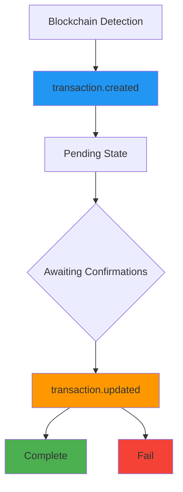

# Transaction Webhook

> [!info] Overview
> Sends real-time notifications whenever a transaction is detected on the blockchain or its status changes. You can track the payment transaction lifecycle to ensure accurate payment processing.

> [!note] Complete Webhook Guide
> For comprehensive webhook implementation guidance including security, retry mechanisms, and testing methods, see [Webhook README](./README).

## 🔔 Transaction Events

### 1. Transaction Creation (`transaction.created`)

**Trigger:** When a transaction is first detected on the blockchain

**Callback URL:** `/callback/create-transaction`

```json
{
  "event": "transaction.created",
  "timestamp": "2025-09-05T10:44:52.516Z",
  "data": {
    "id": "tx-uuid-456",
    "partnerId": "834115c0-81d4-4882-ba8b-f360d86a2c47",
    "customerId": "customer-cuid-123",
    "invoiceId": "550e8400-e29b-41d4-a716-446655440000",
    "idCode": "1/0",
    "assetId": 1001,
    "from": "TEHx4cTUvJcGqidzbruvRc2fL9Tez7oHBr",
    "to": "TMxF2kPwiuS4QJo8tixV5vd4qVuo7zdtRC",
    "amount": "74.074074",
    "fee": "0",
    "balance": null,
    "state": "Pending",
    "type": "DEPOSIT",
    "detail": "d1f10b55e61d16e3616d8d0ac7c42e0edcc8a5587b251239f0a14f587032cb18",
    "blockNum": 75235898,
    "memo": null,
    "createdAt": "2025-09-05T10:44:52.516Z",
    "updatedAt": "2025-09-05T10:44:52.516Z",
    "Asset": {
      "id": 1001,
      "name": "USDT-TRX",
      "symbol": "USDT",
      "network": "TRX"
    },
    "customer": {
      "id": "customer-cuid-123",
      "name": "김민수"
    }
  }
}
```

### 2. Transaction Update (`transaction.updated`)

**Trigger:** When transaction confirmation is completed or fails, causing a final status change

**Callback URL:** `/callback/update-transaction`

#### Success (Complete)

```json
{
  "event": "transaction.updated",
  "timestamp": "2025-09-05T10:45:30.000Z",
  "data": {
    "id": "tx-uuid-456",
    "state": "Complete",
    "previousState": "Pending",
    "detail": "d1f10b55e61d16e3616d8d0ac7c42e0edcc8a5587b251239f0a14f587032cb18",
    "amount": "74.074074",
    "invoiceId": "550e8400-e29b-41d4-a716-446655440000",
    "customerId": "customer-cuid-123",
    "blockConfirmations": 19,
    "finalizedAt": "2025-09-05T10:45:30.000Z",
    "Asset": {
      "id": 1001,
      "symbol": "USDT"
    }
  }
}
```

#### Failure (Fail)

```json
{
  "event": "transaction.updated",
  "timestamp": "2025-09-05T10:46:00.000Z",
  "data": {
    "id": "tx-uuid-456",
    "state": "Fail",
    "previousState": "Pending",
    "detail": "d1f10b55e61d16e3616d8d0ac7c42e0edcc8a5587b251239f0a14f587032cb18",
    "amount": "74.074074",
    "invoiceId": "550e8400-e29b-41d4-a716-446655440000",
    "customerId": "customer-cuid-123",
    "failureReason": "transaction_expired",
    "Asset": {
      "id": 1001,
      "symbol": "USDT"
    }
  }
}
```

---

## 📋 Payload Field Description

### transaction.created Data Fields

|Field|Type|Description|
|---|---|---|
|`id`|string|Unique transaction ID|
|`partnerId`|string|Partner ID|
|`customerId`|string|Customer ID|
|`invoiceId`|string|Related invoice ID|
|`assetId`|number|Asset ID|
|`from`|string|Sender address|
|`to`|string|Recipient address|
|`amount`|string|Transfer amount|
|`state`|string|Transaction status (`Pending`)|
|`type`|string|Transaction type (`DEPOSIT`)|
|`detail`|string|Blockchain transaction hash|
|`blockNum`|number|Block number|
|`Asset`|object|Asset information|
|`customer`|object|Customer information|

### transaction.updated Data Fields

|Field|Type|Description|
|---|---|---|
|`id`|string|Transaction ID|
|`state`|string|Changed status (`Complete`, `Fail`)|
|`previousState`|string|Previous status|
|`blockConfirmations`|number|Number of block confirmations (on success)|
|`finalizedAt`|string|Final confirmation time|
|`failureReason`|string|Failure reason (on failure)|

---

## 🔄 Transaction Lifecycle



> [!note] Status Change Process
>
> 1. **Blockchain Detection**: Customer's transfer transaction is recorded on the blockchain
> 2. **Created Event**: Platform detects the transaction and sends `transaction.created` event
> 3. **Awaiting Confirmations**: Wait for the configured number of confirmations (TRX: 19 confirmations)
> 4. **Updated Event**: Send `transaction.updated` event when confirmation is complete or fails

---

## 🛠️ Transaction Webhook Processing Examples

### Node.js Implementation

```javascript
// Handle transaction creation
app.post('/callback/create-transaction', (req, res) => {
  const { event, data } = req.body;

  if (event !== 'transaction.created') {
    return res.status(400).json({ error: 'Invalid event type' });
  }

  try {
    console.log(`New transaction detected: ${data.id}`);
    console.log(`Amount: ${data.amount} ${data.Asset.symbol}`);
    console.log(`Block number: ${data.blockNum}`);

    // Log transaction
    logTransaction(data);

    // Notify customer of transfer confirmation
    notifyTransactionDetected(data.customerId, data);

    // Update invoice status (Pending)
    updateInvoiceStatus(data.invoiceId, 'Pending');

    res.status(200).json({ status: 'ok' });
  } catch (error) {
    console.error('Transaction creation processing error:', error);
    res.status(500).json({ error: 'Processing failed' });
  }
});

// Handle transaction updates
app.post('/callback/update-transaction', (req, res) => {
  const { event, data } = req.body;

  if (event !== 'transaction.updated') {
    return res.status(400).json({ error: 'Invalid event type' });
  }

  try {
    console.log(`Transaction status changed: ${data.id} → ${data.state}`);

    switch (data.state) {
      case 'Complete':
        console.log(`Payment finalized: ${data.amount} ${data.Asset.symbol}`);
        console.log(`Confirmations: ${data.blockConfirmations}`);

        // Process payment completion
        finalizePayment(data.customerId, data);

        // Complete invoice processing
        completeInvoice(data.invoiceId);

        // Send completion notification
        notifyPaymentFinalized(data.customerId, data);
        break;

      case 'Fail':
        console.log(`Transaction failed: ${data.failureReason}`);

        // Handle failure
        handleTransactionFailure(data);

        // Send failure notification
        notifyTransactionFailure(data.customerId, data);
        break;
    }

    res.status(200).json({ status: 'ok' });
  } catch (error) {
    console.error('Transaction update processing error:', error);
    res.status(500).json({ error: 'Processing failed' });
  }
});

// Business logic functions
async function logTransaction(transactionData) {
  // Save transaction log
  console.log('Saving transaction log:', transactionData.detail);
}

async function notifyTransactionDetected(customerId, data) {
  // Notify customer of transfer detection
  console.log(`Sending transfer detection notification to customer ${customerId}`);
}

async function updateInvoiceStatus(invoiceId, status) {
  // Update invoice status
  console.log(`Changing invoice ${invoiceId} status to ${status}`);
}

async function finalizePayment(customerId, data) {
  // Process final payment completion
  console.log(`Processing final payment completion for customer ${customerId}`);
  // e.g., add account credits, ship products, etc.
}

async function completeInvoice(invoiceId) {
  // Complete invoice processing
  console.log(`Completing invoice ${invoiceId} processing`);
}

async function handleTransactionFailure(data) {
  // Handle transaction failure
  console.log(`Handling transaction ${data.id} failure: ${data.failureReason}`);
}
```

### Python Implementation

```python
from flask import Flask, request, jsonify
import logging

app = Flask(__name__)
logging.basicConfig(level=logging.INFO)

@app.route('/callback/create-transaction', methods=['POST'])
def handle_transaction_created():
    payload = request.get_json()

    if payload.get('event') != 'transaction.created':
        return jsonify({'error': 'Invalid event type'}), 400

    data = payload.get('data', {})

    try:
        transaction_id = data.get('id')
        amount = data.get('amount')
        asset_info = data.get('Asset', {})

        logging.info(f"New transaction detected: {transaction_id}")
        logging.info(f"Amount: {amount} {asset_info.get('symbol')}")

        # Business logic
        log_transaction(data)
        notify_transaction_detected(data.get('customerId'), data)
        update_invoice_status(data.get('invoiceId'), 'Pending')

        return jsonify({'status': 'ok'}), 200

    except Exception as e:
        logging.error(f"Transaction creation processing error: {str(e)}")
        return jsonify({'error': 'Processing failed'}), 500

@app.route('/callback/update-transaction', methods=['POST'])
def handle_transaction_updated():
    payload = request.get_json()

    if payload.get('event') != 'transaction.updated':
        return jsonify({'error': 'Invalid event type'}), 400

    data = payload.get('data', {})

    try:
        transaction_id = data.get('id')
        state = data.get('state')

        logging.info(f"Transaction status changed: {transaction_id} → {state}")

        if state == 'Complete':
            confirmations = data.get('blockConfirmations', 0)
            logging.info(f"Payment finalized, confirmations: {confirmations}")

            finalize_payment(data.get('customerId'), data)
            complete_invoice(data.get('invoiceId'))
            notify_payment_finalized(data.get('customerId'), data)

        elif state == 'Fail':
            failure_reason = data.get('failureReason', 'unknown')
            logging.info(f"Transaction failed: {failure_reason}")

            handle_transaction_failure(data)
            notify_transaction_failure(data.get('customerId'), data)

        return jsonify({'status': 'ok'}), 200

    except Exception as e:
        logging.error(f"Transaction update processing error: {str(e)}")
        return jsonify({'error': 'Processing failed'}), 500

def log_transaction(data):
    """Save transaction log"""
    logging.info(f"Saving transaction log: {data.get('detail')}")

def notify_transaction_detected(customer_id, data):
    """Transfer detection notification"""
    logging.info(f"Sending transfer detection notification to customer {customer_id}")

def update_invoice_status(invoice_id, status):
    """Update invoice status"""
    logging.info(f"Changing invoice {invoice_id} status to {status}")

def finalize_payment(customer_id, data):
    """Process final payment completion"""
    logging.info(f"Processing final payment completion for customer {customer_id}")

def complete_invoice(invoice_id):
    """Complete invoice processing"""
    logging.info(f"Completing invoice {invoice_id} processing")

if __name__ == '__main__':
    app.run(host='0.0.0.0', port=3000, debug=True)
```

---

## 💡 Use Cases

### 1. Real-time Payment Monitoring

```javascript
// Track payment progress
const paymentProgress = {
  'invoice-123': {
    step: 'waiting',
    transactions: []
  }
};

app.post('/callback/create-transaction', (req, res) => {
  const { data } = req.body;
  const invoiceId = data.invoiceId;

  if (paymentProgress[invoiceId]) {
    paymentProgress[invoiceId].step = 'confirming';
    paymentProgress[invoiceId].transactions.push(data.id);

    // Real-time updates (WebSocket, SSE, etc.)
    broadcastPaymentUpdate(invoiceId, 'confirming');
  }

  res.status(200).json({ status: 'ok' });
});
```

### 2. Double Payment Prevention

```javascript
const processedTransactions = new Set();

app.post('/callback/create-transaction', (req, res) => {
  const { data } = req.body;
  const txHash = data.detail;

  if (processedTransactions.has(txHash)) {
    console.log(`Duplicate transaction detected: ${txHash}`);
    return res.status(200).json({ status: 'duplicate' });
  }

  processedTransactions.add(txHash);
  // Normal processing...
});
```

### 3. Automatic Refund Processing

```javascript
app.post('/callback/update-transaction', (req, res) => {
  const { data } = req.body;

  if (data.state === 'Fail' && data.failureReason === 'amount_mismatch') {
    // Automatic refund processing for amount mismatch
    initiateRefund(data);
  }

  res.status(200).json({ status: 'ok' });
});
```

### 4. Transaction Analytics

```javascript
// Collect transaction statistics
const transactionStats = {
  totalReceived: 0,
  averageAmount: 0,
  networkDistribution: {}
};

app.post('/callback/create-transaction', (req, res) => {
  const { data } = req.body;

  // Update statistics
  transactionStats.totalReceived++;

  const amount = parseFloat(data.amount);
  transactionStats.averageAmount =
    (transactionStats.averageAmount + amount) / 2;

  const network = data.Asset.network;
  transactionStats.networkDistribution[network] =
    (transactionStats.networkDistribution[network] || 0) + 1;

  res.status(200).json({ status: 'ok' });
});
```

---

## 🔗 Related Documentation

- [Webhook README](./README) - Webhook Security and Implementation Guide
- [Invoice Webhook](./invoice) - Invoice Webhook
- [Transaction API](../api/transaction) - Transaction Query API

#webhook #transaction #blockchain #callback #documentation