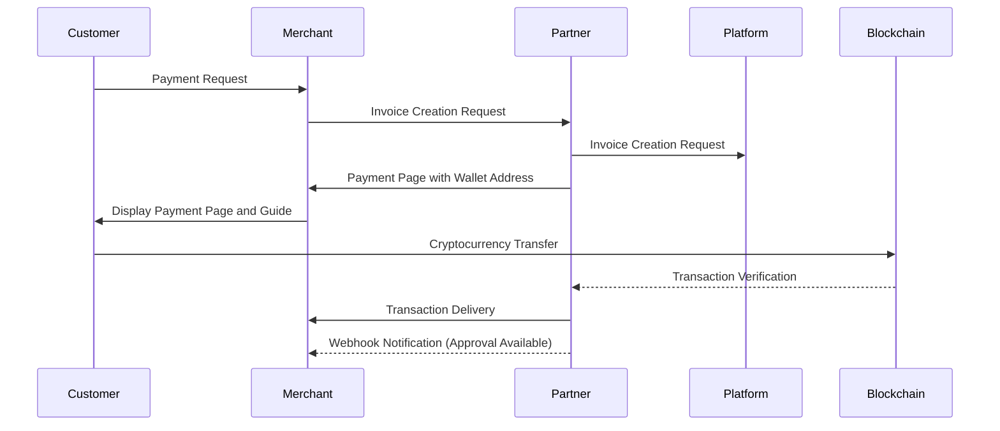

# Getting Started

Tapayz is a payment platform designed to enable anyone to easily accept cryptocurrency payments.
This guide introduces the **complete payment flow**, **API Key issuance and usage**, **Webhook configuration**, and more for Tapayz integration.

---

## Payment Flow Details

Below is the basic payment processing flow of Tapayz.



1. Customer requests payment on the merchant's website.
2. Merchant server requests invoice creation from the **Partner server**.
3. Partner server requests invoice creation from the **Platform server**.
4. Platform server delivers **payment page with wallet address** to the merchant server.
5. Merchant server displays the payment page to the customer and provides payment guidance.
6. Customer transfers cryptocurrency to the specified wallet address.
7. When the transaction is recorded on the network block, a transaction is created and delivered to the merchant.
8. When network confirmation is completed, the transaction is finalized and payment completion status is delivered via webhook.

---

## Prerequisites

1. **Partner Account Creation**
   Create a sub-partner account in the Tapayz console and deliver it to the partner.

2. **API KEY Issuance**

   - API KEY is automatically issued when a partner account is created.
   - The issued key can be found in **Console → My Page → API Information**.
   - When making API calls, set the corresponding key in the `Authorization` header.

   **Example (curl):**

   ```bash
   curl -X GET "https://api.crypted-pay.com/invoices"
   -H "Authorization: <YOUR_API_KEY>"
   ```

   **Example (Node.js axios):**

   ```javascript
   import axios from "axios";

   const response = await axios.get("https://api.crypted-pay.com/invoices", {
     headers: { Authorization: "<YOUR_API_KEY>" },
   });

   console.log(response.data);
   ```

---

## Webhook Configuration

To receive issued invoice and transaction progress information, **callback URL registration** is required.

### Callback Event Types

| Event                | Callback URL Example           | Description                                               |
| -------------------- | ------------------------------ | --------------------------------------------------------- |
| Invoice Update       | `/callback/update-invoice`     | Called when invoice status changes                        |
| Transaction Creation | `/callback/create-transaction` | Called when initial transaction is recorded on blockchain |
| Transaction Update   | `/callback/update-transaction` | Confirmation completion and final status update           |

### Webhook JSON Examples

**`/callback/update-invoice`**

```json
{
  "state": "Pending",
  "customerId": 7,
  "invoiceId": "156c43e3-02f5-47f3-b28c-...",
  "amount": "1.228607"
}
```

**`/callback/create-transaction`**

```json
{
  "id": "1",
  "partnerId": "834115c0-81d4-4882-ba8b-f360d86a2c47",
  "customerId": 7,
  "invoiceId": "156c43e3-02f5-47f3-b28c-6bf6c511d796",
  "idCode": "1/0",
  "assetId": 1001,
  "from": "TEHx4cTUvJcGqidzbruvRc2fL9Tez7oHBr",
  "to": "TMxF2kPwiuS4QJo8tixV5vd4qVuo7zdtRC",
  "amount": "1.229",
  "fee": "0",
  "balance": null,
  "state": "Pending",
  "type": "DEPOSIT",
  "detail": "d1f10b55e61d16e3616d8d0ac7c42e0edcc8a5587b251239f0a14f587032cb18",
  "blockNum": 75235898,
  "memo": null,
  "createdAt": "2025-08-28T07:44:52.516Z",
  "updatedAt": "2025-08-28T07:44:52.516Z"
}
```

**`/callback/update-transaction`**

```json
{
  "id": "tx_4f5d9a",
  "state": "Complete",
  "detail": "d1f10b55e61d16e3...",
  "amount": "1.228607"
}
```

---

## Next Steps

- Follow the [Quick Flow](./quickflow.md) guide
