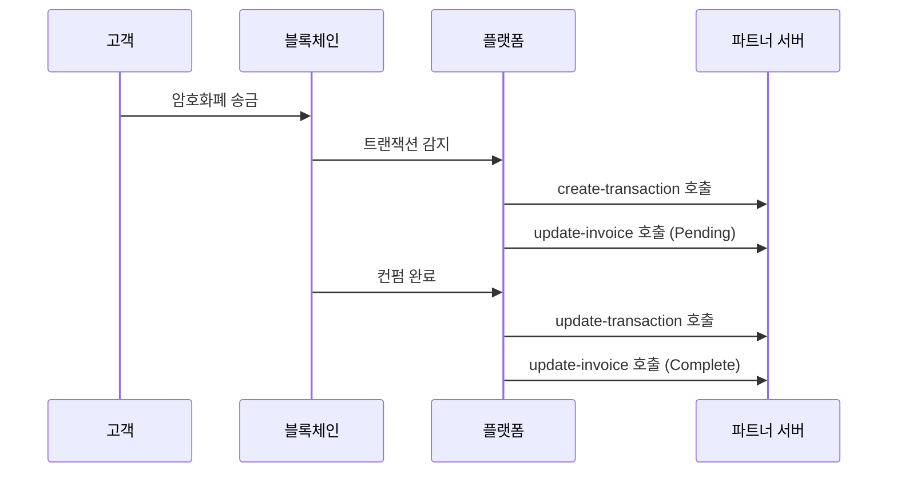

# Webhook

> [!info] 개요 Tapayz의 Webhook 시스템은 결제 프로세스 중 발생하는 다양한 이벤트를 실시간으로 알려주는 HTTP 콜백 메커니즘입니다. 인보이스 상태 변경, 트랜잭션 생성/업데이트 등의 이벤트가 발생할 때마다 등록된 엔드포인트로 알림을 전송합니다.

## 🔔 Webhook 종류

### 지원하는 이벤트

| 이벤트                | 콜백 URL                       | 설명                                         |
| --------------------- | ------------------------------ | -------------------------------------------- |
| **인보이스 업데이트** | `/callback/update-invoice`     | 인보이스 상태 변경 시 호출                   |
| **트랜잭션 생성**     | `/callback/create-transaction` | 블록체인에 트랜잭션이 최초 기록될 때 호출    |
| **트랜잭션 업데이트** | `/callback/update-transaction` | 트랜잭션 컨펌 완료 및 최종 상태 변경 시 호출 |

### 이벤트 흐름



---

## 📨 공통 페이로드 구조

모든 Webhook 이벤트는 다음과 같은 기본 구조를 따릅니다:

```json
{
  "event": "이벤트타입",
  "timestamp": "2025-09-05T10:45:00.000Z",
  "data": {
    // 이벤트별 특화 데이터
  }
}
```

### 공통 필드

| 필드        | 타입   | 설명                        |
| ----------- | ------ | --------------------------- |
| `event`     | string | 이벤트 타입                 |
| `timestamp` | string | 이벤트 발생 시간 (ISO 8601) |
| `data`      | object | 이벤트별 세부 데이터        |

---

## 🔒 보안 및 인증

### 1. 시그니처 검증

> [!warning] 필수 보안 조치 Webhook 요청의 진위를 확인하기 위해 HMAC-SHA256 시그니처 검증을 구현하는 것을 강력히 권장합니다.

**시그니처 생성 방법:**

```javascript
const crypto = require("crypto");

const signature = crypto
  .createHmac("sha256", WEBHOOK_SECRET)
  .update(JSON.stringify(payload))
  .digest("hex");
```

**검증 구현:**

```javascript
function verifySignature(payload, signature, secret) {
  const hash = crypto
    .createHmac("sha256", secret)
    .update(JSON.stringify(payload))
    .digest("hex");

  return crypto.timingSafeEqual(
    Buffer.from(signature, "hex"),
    Buffer.from(hash, "hex")
  );
}

// 사용 예시
app.post("/callback/*", (req, res) => {
  const signature = req.headers["x-signature"];
  const isValid = verifySignature(
    req.body,
    signature,
    process.env.WEBHOOK_SECRET
  );

  if (!isValid) {
    return res.status(401).json({ error: "Invalid signature" });
  }

  // Webhook 처리 로직
});
```

### 2. IP 화이트리스트

특정 IP 주소에서만 Webhook을 수신하도록 제한:

```javascript
const allowedIPs = ["52.78.123.45", "13.125.67.89"]; // 플랫폼 서버 IP

app.use("/callback", (req, res, next) => {
  const clientIP = req.ip || req.connection.remoteAddress;

  if (!allowedIPs.includes(clientIP)) {
    return res.status(403).json({ error: "Forbidden IP" });
  }

  next();
});
```

---

## ⚡ 모범 사례

### 1. 멱등성 보장

동일한 이벤트가 여러 번 전송될 수 있으므로 멱등성을 보장하세요:

```javascript
const processedEvents = new Set();

app.post("/callback/*", (req, res) => {
  // 이벤트 고유 식별자 생성
  const eventId = generateEventId(req.body);

  if (processedEvents.has(eventId)) {
    return res.status(200).json({ status: "already_processed" });
  }

  try {
    processEvent(req.body);
    processedEvents.add(eventId);
    res.status(200).json({ status: "ok" });
  } catch (error) {
    res.status(500).json({ error: "Processing failed" });
  }
});

function generateEventId(payload) {
  // 이벤트 타입과 주요 식별자로 고유 ID 생성
  switch (payload.event) {
    case "invoice.updated":
      return `${payload.data.invoiceId}-${payload.data.state}-${payload.timestamp}`;
    case "transaction.created":
    case "transaction.updated":
      return `${payload.data.id}-${payload.data.state}-${payload.timestamp}`;
    default:
      return `${payload.event}-${payload.timestamp}`;
  }
}
```

### 2. 비동기 처리

무거운 작업은 백그라운드로 분리하여 빠른 응답을 보장:

```javascript
const Queue = require("bull"); // 또는 다른 큐 시스템
const webhookQueue = new Queue("webhook processing");

app.post("/callback/*", (req, res) => {
  // 빠른 응답
  res.status(200).json({ status: "received" });

  // 백그라운드 처리
  webhookQueue.add("process-webhook", req.body);
});

// 워커에서 실제 처리
webhookQueue.process("process-webhook", async (job) => {
  const payload = job.data;
  await processWebhookEvent(payload);
});
```

### 3. 재시도 메커니즘

```javascript
async function processEventWithRetry(eventData, maxRetries = 3) {
  for (let attempt = 1; attempt <= maxRetries; attempt++) {
    try {
      await processEvent(eventData);
      return { success: true };
    } catch (error) {
      console.error(`재시도 ${attempt}/${maxRetries} 실패:`, error);

      if (attempt === maxRetries) {
        // 최종 실패 - 데드레터큐에 저장
        await saveToDeadLetterQueue(eventData, error);
        throw error;
      }

      // 지수적 백오프 (1초, 2초, 4초...)
      await new Promise((resolve) =>
        setTimeout(resolve, Math.pow(2, attempt) * 1000)
      );
    }
  }
}
```

### 4. 로깅 및 모니터링

```javascript
const winston = require("winston");

const logger = winston.createLogger({
  level: "info",
  format: winston.format.combine(
    winston.format.timestamp(),
    winston.format.json()
  ),
  transports: [new winston.transports.File({ filename: "webhook.log" })],
});

app.post("/callback/*", (req, res) => {
  const startTime = Date.now();
  const payload = req.body;

  logger.info("Webhook 수신", {
    event: payload.event,
    path: req.path,
    userAgent: req.headers["user-agent"],
    ip: req.ip,
  });

  try {
    processEvent(payload);

    const duration = Date.now() - startTime;
    logger.info("Webhook 처리 완료", {
      event: payload.event,
      duration: `${duration}ms`,
      status: "success",
    });

    res.status(200).json({ status: "ok" });
  } catch (error) {
    logger.error("Webhook 처리 실패", {
      event: payload.event,
      error: error.message,
      stack: error.stack,
    });

    res.status(500).json({ error: "Processing failed" });
  }
});
```

---

## 🔧 테스트 및 디버깅

### 로컬 개발 환경 설정

**1. ngrok을 사용한 로컬 터널링:**

```bash
# ngrok 설치 후
ngrok http 3000

# 출력된 URL을 Webhook URL로 등록
# 예: https://abc123.ngrok.io/callback/update-invoice
```

**2. 테스트 서버 구성:**

```javascript
const express = require("express");
const app = express();

app.use(express.json());

// 모든 Webhook 이벤트 로깅
app.post("/callback/*", (req, res) => {
  console.log("=== Webhook 수신 ===");
  console.log("Path:", req.path);
  console.log("Headers:", req.headers);
  console.log("Body:", JSON.stringify(req.body, null, 2));
  console.log("==================");

  res.status(200).json({ status: "ok" });
});

app.listen(3000, () => {
  console.log("테스트 서버가 포트 3000에서 실행 중");
});
```

### 수동 테스트

Webhook 동작을 확인하기 위한 수동 테스트:

```bash
# 인보이스 업데이트 테스트
curl -X POST http://localhost:3000/callback/update-invoice \
  -H "Content-Type: application/json" \
  -H "X-Signature: test-signature" \
  -d '{
    "event": "invoice.updated",
    "timestamp": "2025-09-05T10:45:00.000Z",
    "data": {
      "invoiceId": "test-invoice-123",
      "state": "Complete"
    }
  }'

# 트랜잭션 생성 테스트
curl -X POST http://localhost:3000/callback/create-transaction \
  -H "Content-Type: application/json" \
  -d '{
    "event": "transaction.created",
    "timestamp": "2025-09-05T10:44:52.516Z",
    "data": {
      "id": "test-tx-456",
      "state": "Pending"
    }
  }'
```

---

## 📊 모니터링 및 알림

### 성능 메트릭

모니터링해야 할 주요 지표:

```javascript
const metrics = {
  webhookReceived: 0,
  webhookProcessed: 0,
  webhookFailed: 0,
  averageProcessingTime: 0,
};

// 메트릭 수집
app.post("/callback/*", (req, res) => {
  const startTime = Date.now();
  metrics.webhookReceived++;

  try {
    processEvent(req.body);
    metrics.webhookProcessed++;

    const duration = Date.now() - startTime;
    metrics.averageProcessingTime =
      (metrics.averageProcessingTime + duration) / 2;

    res.status(200).json({ status: "ok" });
  } catch (error) {
    metrics.webhookFailed++;
    res.status(500).json({ error: "Processing failed" });
  }
});

// 메트릭 엔드포인트
app.get("/metrics", (req, res) => {
  res.json(metrics);
});
```

### 헬스체크

```javascript
app.get("/health", (req, res) => {
  const health = {
    status: "healthy",
    timestamp: new Date().toISOString(),
    uptime: process.uptime(),
    memory: process.memoryUsage(),
    webhookStatus: {
      received: metrics.webhookReceived,
      processed: metrics.webhookProcessed,
      failed: metrics.webhookFailed,
      successRate:
        metrics.webhookReceived > 0
          ? (
              (metrics.webhookProcessed / metrics.webhookReceived) *
              100
            ).toFixed(2)
          : 0,
    },
  };

  res.json(health);
});
```

---

## ⚠️ 주의사항

> [!warning] 중요 사항
>
> 1. **응답 시간**: Webhook 핸들러는 **5초 이내**에 응답해야 합니다.
> 2. **상태 코드**: 성공 시 반드시 **200** 상태 코드를 반환하세요.
> 3. **재시도**: 실패 시 **최대 3회**까지 재시도됩니다.
> 4. **순서**: 이벤트 순서가 보장되지 않을 수 있습니다.
> 5. **중복**: 동일한 이벤트가 여러 번 전송될 수 있습니다.

> [!tip] 팁
>
> - 무거운 처리는 반드시 백그라운드 작업으로 분리하세요.
> - 데이터베이스 트랜잭션을 사용하여 일관성을 보장하세요.
> - 테스트 환경에서 충분히 검증 후 프로덕션에 적용하세요.
> - Webhook 실패 시 대안 조회 방법을 준비하세요.

---

## 🔗 관련 문서

- [[webhook/invoice]] - 인보이스 Webhook 상세
- [[webhook/transaction]] - 트랜잭션 Webhook 상세
- [[invoice]] - 인보이스 API
- [[transaction]] - 거래 조회 API

#webhook #callback #security #monitoring #documentation
