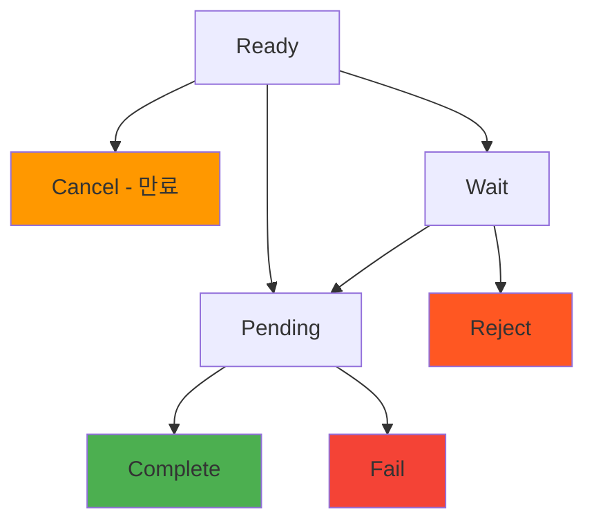

# 인보이스 Webhook

> [!info] 개요 인보이스 상태가 변경될 때마다 `/callback/update-invoice` 엔드포인트로 실시간 알림을 전송합니다. 결제 완료, 만료, 실패 등의 상태 변경을 즉시 감지하여 비즈니스 로직을 처리할 수 있습니다.

> [!note] 전체 Webhook 가이드 보안, 재시도, 테스트 방법 등 전반적인 Webhook 구현 가이드는 [[webhook/README]]를 참고하세요.

## 🔔 인보이스 이벤트

### 이벤트 타입: `invoice.updated`

**발생 시점:**

- 고객이 결제를 완료했을 때 (`Ready` → `Pending` → `Complete`)
- 인보이스가 만료되었을 때 (`Ready` → `Cancel`)
- 결제가 실패했을 때 (`Pending` → `Fail`)
- 결제가 거부되었을 때 (`Wait` → `Reject`)

### 상태 변경 흐름



> [!note] 상태별 Webhook 발송
> 
> - **Ready → Pending**: 고객이 송금을 시작할 때
> - **Pending → Complete**: 블록체인 컨펌 완료 시
> - **Pending → Fail**: 금액 불일치 또는 트랜잭션 실패 시
> - **Ready → Cancel**: 만료 시간 도달 시 (스케줄러가 1분마다 확인)

---

## 📨 Webhook 페이로드

### 결제 완료 (Complete)

```json
{
  "event": "invoice.updated",
  "timestamp": "2025-09-05T10:45:00.000Z",
  "data": {
    "invoiceId": "550e8400-e29b-41d4-a716-446655440000",
    "customerId": "customer-cuid-123",
    "customerName": "김민수",
    "state": "Complete",
    "previousState": "Pending",
    "title": "USDT 10만원 구매",
    "cashAmount": "100000.000000",
    "cryptoAmount": "74.074074",
    "cashAssetId": 1,
    "cryptoAssetId": 1001,
    "completedAt": "2025-09-05T10:45:00.000Z",
    "createdAt": "2025-09-05T10:30:00.000Z",
    "transaction": {
      "id": "tx-uuid-456",
      "detail": "d1f10b55e61d16e3616d8d0ac7c42e0edcc8a5587b251239f0a14f587032cb18",
      "from": "TEHx4cTUvJcGqidzbruvRc2fL9Tez7oHBr",
      "to": "TMxF2kPwiuS4QJo8tixV5vd4qVuo7zdtRC",
      "blockNum": 75235898
    }
  }
}
```

### 결제 진행 중 (Pending)

```json
{
  "event": "invoice.updated",
  "timestamp": "2025-09-05T10:44:52.516Z",
  "data": {
    "invoiceId": "550e8400-e29b-41d4-a716-446655440000",
    "customerId": "customer-cuid-123",
    "customerName": "김민수",
    "state": "Pending",
    "previousState": "Ready",
    "title": "USDT 10만원 구매",
    "cashAmount": "100000.000000",
    "cryptoAmount": "74.074074",
    "transaction": {
      "id": "tx-uuid-456",
      "detail": "d1f10b55e61d16e3616d8d0ac7c42e0edcc8a5587b251239f0a14f587032cb18"
    }
  }
}
```

### 결제 만료 (Cancel)

```json
{
  "event": "invoice.updated",
  "timestamp": "2025-09-05T11:00:00.000Z",
  "data": {
    "invoiceId": "550e8400-e29b-41d4-a716-446655440000",
    "customerId": "customer-cuid-123",
    "customerName": "김민수",
    "state": "Cancel",
    "previousState": "Ready",
    "title": "USDT 10만원 구매",
    "expiredAt": "2025-09-05T11:00:00.000Z",
    "reason": "expired"
  }
}
```

### 결제 실패 (Fail)

```json
{
  "event": "invoice.updated",
  "timestamp": "2025-09-05T10:50:00.000Z",
  "data": {
    "invoiceId": "550e8400-e29b-41d4-a716-446655440000",
    "customerId": "customer-cuid-123",
    "customerName": "김민수",
    "state": "Fail",
    "previousState": "Pending",
    "title": "USDT 10만원 구매",
    "reason": "amount_mismatch",
    "transaction": {
      "id": "tx-uuid-456",
      "detail": "d1f10b55e61d16e3616d8d0ac7c42e0edcc8a5587b251239f0a14f587032cb18",
      "receivedAmount": "70.000000",
      "expectedAmount": "74.074074"
    }
  }
}
```

---

## 📋 페이로드 필드 설명

### 데이터 필드

|필드|타입|설명|
|---|---|---|
|`invoiceId`|string|인보이스 ID|
|`customerId`|string|고객 ID|
|`customerName`|string|고객 이름|
|`state`|string|변경된 상태|
|`previousState`|string|이전 상태|
|`title`|string|인보이스 제목|
|`cashAmount`|string|법정화폐 금액|
|`cryptoAmount`|string|암호화폐 금액|
|`cashAssetId`|number|법정화폐 자산 ID|
|`cryptoAssetId`|number|암호화폐 자산 ID|
|`completedAt`|string|완료 시간 (Complete 상태일 때)|
|`expiredAt`|string|만료 시간 (Cancel 상태일 때)|
|`reason`|string|상태 변경 사유|
|`transaction`|object|관련 트랜잭션 정보|

---

## 🛠️ 인보이스 Webhook 처리 예시

### Node.js 구현

```javascript
app.post('/callback/update-invoice', (req, res) => {
  const { event, data } = req.body;
  
  if (event !== 'invoice.updated') {
    return res.status(400).json({ error: 'Invalid event type' });
  }
  
  try {
    // 상태별 비즈니스 로직 처리
    switch (data.state) {
      case 'Pending':
        console.log(`결제 진행 중: ${data.invoiceId}`);
        notifyCustomer(data.customerId, 'payment_pending');
        break;
        
      case 'Complete':
        console.log(`결제 완료: ${data.invoiceId}, 금액: ${data.cashAmount}`);
        // 사용자 계정에 크레딧 추가
        addUserCredit(data.customerName, parseFloat(data.cashAmount));
        sendPaymentConfirmation(data.customerId, data);
        break;
        
      case 'Fail':
        console.log(`결제 실패: ${data.invoiceId}, 사유: ${data.reason}`);
        notifyPaymentFailure(data.customerId, data.reason);
        break;
        
      case 'Cancel':
        console.log(`결제 만료: ${data.invoiceId}`);
        notifyPaymentExpired(data.customerId);
        break;
    }
    
    res.status(200).json({ status: 'ok' });
  } catch (error) {
    console.error('Webhook 처리 오류:', error);
    res.status(500).json({ error: 'Internal server error' });
  }
});

// 비즈니스 로직 함수들
async function addUserCredit(username, amount) {
  console.log(`사용자 ${username}에게 ${amount}원 크레딧 추가`);
  // 예: await db.user.update({ username }, { $inc: { credit: amount } });
}

async function notifyCustomer(customerId, type) {
  console.log(`고객 ${customerId}에게 ${type} 알림 전송`);
}
```

### Python 구현

```python
from flask import Flask, request, jsonify
import logging

app = Flask(__name__)
logging.basicConfig(level=logging.INFO)

@app.route('/callback/update-invoice', methods=['POST'])
def handle_invoice_update():
    payload = request.get_json()
    
    if payload.get('event') != 'invoice.updated':
        return jsonify({'error': 'Invalid event type'}), 400
    
    data = payload.get('data', {})
    
    try:
        state = data.get('state')
        invoice_id = data.get('invoiceId')
        customer_name = data.get('customerName')
        
        if state == 'Pending':
            logging.info(f"결제 진행 중: {invoice_id}")
            notify_customer(data.get('customerId'), 'payment_pending')
            
        elif state == 'Complete':
            cash_amount = float(data.get('cashAmount', 0))
            logging.info(f"결제 완료: {invoice_id}, 금액: {cash_amount}")
            add_user_credit(customer_name, cash_amount)
            send_payment_confirmation(data.get('customerId'), data)
            
        elif state == 'Fail':
            reason = data.get('reason', 'unknown')
            logging.info(f"결제 실패: {invoice_id}, 사유: {reason}")
            notify_payment_failure(data.get('customerId'), reason)
            
        elif state == 'Cancel':
            logging.info(f"결제 만료: {invoice_id}")
            notify_payment_expired(data.get('customerId'))
        
        return jsonify({'status': 'ok'}), 200
        
    except Exception as e:
        logging.error(f"Webhook 처리 오류: {str(e)}")
        return jsonify({'error': 'Internal server error'}), 500

def add_user_credit(username, amount):
    """사용자 크레딧 추가"""
    logging.info(f"사용자 {username}에게 {amount}원 크레딧 추가")

def notify_customer(customer_id, notification_type):
    """고객 알림"""
    logging.info(f"고객 {customer_id}에게 {notification_type} 알림 전송")

if __name__ == '__main__':
    app.run(host='0.0.0.0', port=3000, debug=True)
```

---

## 💡 활용 사례

### 1. 실시간 잔액 업데이트

```javascript
app.post('/callback/update-invoice', (req, res) => {
  const { data } = req.body;
  
  if (data.state === 'Complete') {
    // 사용자 잔액 즉시 반영
    const amount = parseFloat(data.cashAmount);
    updateUserBalance(data.customerName, amount);
    
    // 실시간 UI 업데이트 (WebSocket)
    broadcastBalanceUpdate(data.customerId, amount);
  }
  
  res.status(200).json({ status: 'ok' });
});
```

### 2. 자동 상품 배송

```javascript
app.post('/callback/update-invoice', (req, res) => {
  const { data } = req.body;
  
  if (data.state === 'Complete') {
    // 디지털 상품 자동 배송
    deliverDigitalProduct(data.customerId, data.title);
    
    // 배송 완료 이메일 발송
    sendDeliveryNotification(data.customerId);
  }
  
  res.status(200).json({ status: 'ok' });
});
```

### 3. 결제 실패 자동 처리

```javascript
app.post('/callback/update-invoice', (req, res) => {
  const { data } = req.body;
  
  if (data.state === 'Fail' && data.reason === 'amount_mismatch') {
    // 금액 불일치 시 부분 환불 처리
    const receivedAmount = parseFloat(data.transaction.receivedAmount);
    initiatePartialRefund(data.customerId, receivedAmount);
  }
  
  res.status(200).json({ status: 'ok' });
});
```

---

## 🔗 관련 문서

- [[webhook/README]] - Webhook 보안 및 구현 가이드
- [[webhook/transaction]] - 트랜잭션 Webhook
- [[invoice]] - 인보이스 API

#webhook #invoice #callback #notification #documentation